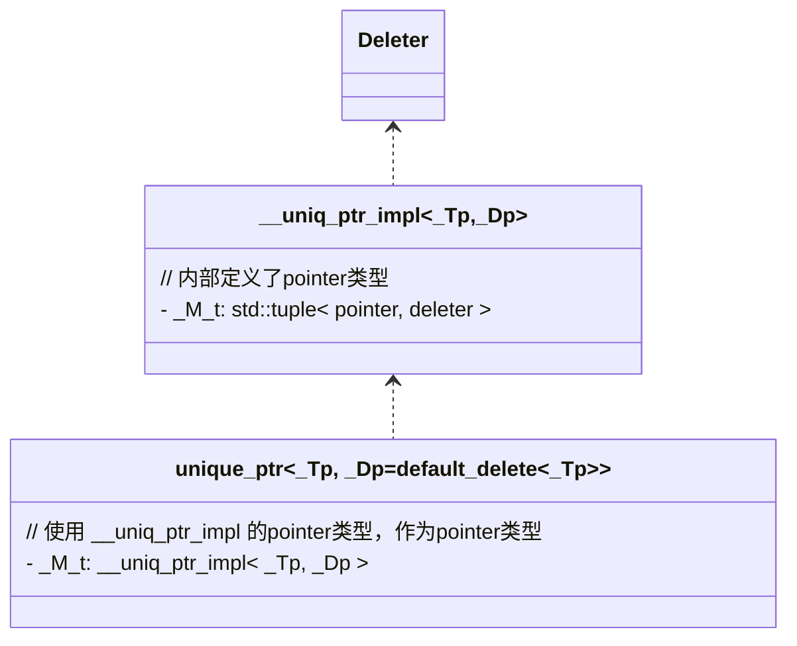

# std::unique\_ptr

> 📌本文使用wolai制作，原文链接：[std::unique\_ptr](https://www.wolai.com/5kf4Mci5ETPySzSafqkAiS "std::unique_ptr")

unique\_ptr是c++11引入的智能指针之一，对所wrap的对象具有独一管理权。本文做详细分析。

分析环境: gcc 8.3.0

# 1. 类图



# 2. 基本声明

```c++
  template <typename _Tp, typename _Dp = default_delete<_Tp>>
    class unique_ptr
    
  template<typename _Tp, typename _Dp>
class unique_ptr<_Tp[], _Dp>


```

`unique_ptr` 的 primary template具有两个模板参数，一个是要管理的类型`_Tp`一个是删除器，默认参数为`default_delete<_Tp>`. 还有一个偏特化，接受数组类型，此时的删除器需要user自定义类型。

# 3. deleter

先看删除器的实现。 非数组类型的:

```c++
  /// Primary template of default_delete, used by unique_ptr
  template<typename _Tp>
    struct default_delete
    {
      /// Default constructor
      constexpr default_delete() noexcept = default;

      /** @brief Converting constructor.
       *
       * Allows conversion from a deleter for arrays of another type, @p _Up,
       * only if @p _Up* is convertible to @p _Tp*.
       */
      template<typename _Up, typename = typename
         enable_if<is_convertible<_Up*, _Tp*>::value>::type>
        default_delete(const default_delete<_Up>&) noexcept { }

      /// Calls @c delete @p __ptr
      void
      operator()(_Tp* __ptr) const
      {
  static_assert(!is_void<_Tp>::value,
          "can't delete pointer to incomplete type");
  static_assert(sizeof(_Tp)>0,
          "can't delete pointer to incomplete type");
  delete __ptr;
      }
    };

```

本质上是一个functor，有一个默认构造函数和一个拷贝构造函数，但是拷贝构造函数是一个模板成员函数，enable的条件是，能从`_Up*`类型转换为`_Tp*`类型。这是什么意思？举个例子：

```c++
std::unique_ptr<int> intPtr(new int(10));
std::unique_ptr<double> doublePtr(new double(3.14));

//  你可以使用 default_delete<void*> 来管理这两个指针，因为 int* 和 double* 都可以转换为 void*
std::unique_ptr<int, default_delete<void*>> intPtr2(intPtr.release());
std::unique_ptr<double, default_delete<void*>> doublePtr2(doublePtr.release());

//  但是你不能使用 default_delete<int> 来管理 doublePtr，因为 double* 不能转换为 int*
// std::unique_ptr<double, default_delete<int>> doublePtr3(doublePtr.release()); //编译错误
```

functor的实现是直接`delete __ptr`。

另一个是数组类型的deleter:

```c++
  template<typename _Tp>
    struct default_delete<_Tp[]>
    {
    public:
      /// Default constructor
      constexpr default_delete() noexcept = default;

      /** @brief Converting constructor.
       *
       * Allows conversion from a deleter for arrays of another type, such as
       * a const-qualified version of @p _Tp.
       *
       * Conversions from types derived from @c _Tp are not allowed because
       * it is unsafe to @c delete[] an array of derived types through a
       * pointer to the base type.
       */
      template<typename _Up, typename = typename
         enable_if<is_convertible<_Up(*)[], _Tp(*)[]>::value>::type>
        default_delete(const default_delete<_Up[]>&) noexcept { }

      /// Calls @c delete[] @p __ptr
      template<typename _Up>
      typename enable_if<is_convertible<_Up(*)[], _Tp(*)[]>::value>::type
  operator()(_Up* __ptr) const
      {
  static_assert(sizeof(_Tp)>0,
          "can't delete pointer to incomplete type");
  delete [] __ptr;
      }
    };


```

和非数组类型基本一样，只不过删除调用的是`delete[]`

# `4. __uniq_ptr_impl`

本类是`unique_ptr`实现的核心类，先分析:

## 4.1. 构造函数

构造函数1：

```c++
      __uniq_ptr_impl(pointer __p) : _M_t() { _M_ptr() = __p; }
      
      pointer&   _M_ptr() { return std::get<0>(_M_t); }
      
      _Dp&       _M_deleter() { return std::get<1>(_M_t); }

private:
      tuple<pointer, _Dp> _M_t;  // 待会解释这个pointer类型


```

本质上`__uniq_ptr_impl`就是一个tuple，tuple 0 index是指针，1 index是`_Dp`。

> TODO(zhangxingrui)为什么不用pair？ tuple有优化?

基本构造函数中，初始化`tuple，`并把index 0复制为`__p`.

> 📌初始化tuple的时候，会调用deleter的默认构造函数

构造函数2:

```c++
      template<typename _Del>
      __uniq_ptr_impl(pointer __p, _Del&& __d)
  : _M_t(__p, std::forward<_Del>(__d)) { }

```

直接把`deleter`传入并转发给`_M_t`（tuple）构造。

> TODO(zhangxingrui): 暂不清楚tuple 构造函数是如何实现。

## 4.2. pointer类型

`__uniq_ptr_Impl`有个相对复杂的类型，即tuple的pointer类型。

```c++
  template <typename _Tp, typename _Dp>
    class __uniq_ptr_impl
    {
      template <typename _Up, typename _Ep, typename = void>
  struct _Ptr
  {
    using type = _Up*;
  };

      template <typename _Up, typename _Ep>
  struct
  _Ptr<_Up, _Ep, __void_t<typename remove_reference<_Ep>::type::pointer>>
  {
    using type = typename remove_reference<_Ep>::type::pointer;
  };

    public:

      using pointer = typename _Ptr<_Tp, _Dp>::type;

```

这是一个class template.  且有一个偏特化的版本。

对于primary template来说，type 就是` _Up*`

对于偏特化版本，如果传入的`_Dp`在`remote_reference`后持有`pointer`类型，则使用自定义deleter的pointer类型作为整个`__uniq_ptr_impl` pointer类型。

也就是说：

- **有自定义删除器且自定义删除器有**\*\*`pointer类型`:\*\* 使用自定义删除器提供的`pointer` 类型作为指针类型。
- **否则** 使用 `_Up*` 作为指针类型。

# 5. unique\_ptr非数组类型实现

先看成员变量和type：

```c++
      template <class _Up>
      using _DeleterConstraint =
  typename __uniq_ptr_impl<_Tp, _Up>::_DeleterConstraint::type;

      __uniq_ptr_impl<_Tp, _Dp> _M_t;

```

内部持有了一个别名模板，引用自`__uniq_ptr_impl`，看下实现:

```c++
using _DeleterConstraint = enable_if<
  __and_<__not_<is_pointer<_Dp>>,
   is_default_constructible<_Dp>>::value>;   // _Dp 就是传入的deleter的类型

```

这句话的意思是，检测传入的deleter类型不能是一个指针，并且持有默认构造器。

## 5.1. 构造函数

只看常用的构造函数：

```c++
      /** Takes ownership of a pointer.
       *
       * @param __p  A pointer to an object of @c element_type
       *
       * The deleter will be value-initialized.
       */
      template <typename _Up = _Dp,
    typename = _DeleterConstraint<_Up>>
  explicit
  unique_ptr(pointer __p) noexcept
  : _M_t(__p)
        { }


```

也是一个模板构造函数，SFINA机制保证，传入的`_Dp`类型不能是指针，同时具有默认构造函数。

再看移动构造：

```c++
    /// Move constructor.
    unique_ptr(unique_ptr&& __u) noexcept
    : _M_t(__u.release(), std::forward<deleter_type>(__u.get_deleter())) { }

```

把rhs只有的指针释放，同时把deleter转发。

## 5.2. 析构函数

```c++
      /// Destructor, invokes the deleter if the stored pointer is not null.
      ~unique_ptr() noexcept
      {
  auto& __ptr = _M_t._M_ptr();
  if (__ptr != nullptr)
    get_deleter()(__ptr);  // 析构
  __ptr = pointer();  // 置空pointer，用{}是不是就行了？
      }
      
            /// Return a reference to the stored deleter.
      deleter_type&
      get_deleter() noexcept
      { return _M_t._M_deleter(); }  // 获取 __uniq_ptr_impl 的deleter


```

## 5.3. operator=(&&) move 持有权

```c++
      // Assignment.

      /** @brief Move assignment operator.
       *
       * @param __u  The object to transfer ownership from.
       *
       * Invokes the deleter first if this object owns a pointer.
       */
      unique_ptr&
      operator=(unique_ptr&& __u) noexcept
      {
  reset(__u.release());
  get_deleter() = std::forward<deleter_type>(__u.get_deleter());
  return *this;
      }

      /** @brief Replace the stored pointer.
       *
       * @param __p  The new pointer to store.
       *
       * The deleter will be invoked if a pointer is already owned.
       */
      void
      reset(pointer __p = pointer()) noexcept
      {
  using std::swap;
  swap(_M_t._M_ptr(), __p);
  if (__p != pointer())
    get_deleter()(__p);
      }


```

通过reset，将pointer所有权从rhs转移到this指针。重新复制deleter。

> 📌注意：这个过程不是原子的。 如果在move unique\_ptr过程中，出现并发，是可能有问题的。

## 5.4. 判空

unique\_ptr 重载了bool，所以可以直接拿`unique_ptr`对象在if语句中判空:

```c++
      /// Return @c true if the stored pointer is not null.
      explicit operator bool() const noexcept
      { return get() == pointer() ? false : true; }

```

实际上就是看内部指针是否为空。

## `5.5. *`和`→`

```c++
      /// Dereference the stored pointer.
      typename add_lvalue_reference<element_type>::type
      operator*() const
      {
  __glibcxx_assert(get() != pointer());
  return *get();
      }

      /// Return the stored pointer.
      pointer
      operator->() const noexcept
      {
  _GLIBCXX_DEBUG_PEDASSERT(get() != pointer());
  return get();
      }

```

# 6. unique\_ptr 数组类型实现

偏特化声明:

```c++
  template<typename _Tp, typename _Dp>
    class unique_ptr<_Tp[], _Dp>

```

这样接收的类型为数组类型时，会有限匹配此特化版本。如:

```c++
  std::unique_ptr<int[]> b(new int[10]);

```

实际上匹配展开为:

```c++
  std::unique_ptr<int[], std::default_delete<int[]> > b = std::unique_ptr<int[], std::default_delete<int[]> >(new int[10]);

```

> 为什么数组类型的`_Dp`没有默认值，也能自定匹配到`default_delete[]`?
> 模板默认值只用在primary template中声明即可。因为primary template声明为：
>
> ```c++
>   template <typename _Tp, typename _Dp = default_delete<_Tp>>
>     class unique_ptr
>
> ```
>
> 所以能自动匹配。

unique\_ptr数组类型的实现和非数组类型基本完全一致。区别在于多提供一些数组访问符号。如

```c++
      /// Access an element of owned array.
      typename std::add_lvalue_reference<element_type>::type
      operator[](size_t __i) const
      {
  __glibcxx_assert(get() != pointer());
  return get()[__i];
      }

```

# 7. make\_unique

```c++
  /// std::make_unique for single objects
  template<typename _Tp, typename... _Args>
    inline typename _MakeUniq<_Tp>::__single_object
    make_unique(_Args&&... __args)
    { return unique_ptr<_Tp>(new _Tp(std::forward<_Args>(__args)...)); }

  /// std::make_unique for arrays of unknown bound
  template<typename _Tp>
    inline typename _MakeUniq<_Tp>::__array
    make_unique(size_t __num)
    { return unique_ptr<_Tp>(new remove_extent_t<_Tp>[__num]()); }

```

make\_unique 提供了single object和arrary类型的快速make函数。但是和调用构造函数+new object的方式没什么不同。（shared\_ptr就不一样）。

# 8. 总结

本文档深入分析了C++11标准库中的`unique_ptr`智能指针，重点探讨了其内部实现、使用场景以及与之相关的概念，包括`deleter`、`__uniq_ptr_impl`核心类等。`unique_ptr`是一种独占所有权的智能指针，它通过`__uniq_ptr_impl`类来实现对资源的管理，确保每个被管理的对象都只有一个所有者。

`unique_ptr`的基本声明包含一个模板参数`_Tp`表示要管理的对象类型，以及可选的第二个模板参数`_Dp`用于指定删除器类型，默认值为`default_delete<_Tp>`。这种灵活性允许用户根据需要提供自定义的删除逻辑。

文章首先介绍了`deleter`的概念，它是`unique_ptr`中用于处理资源释放的部分。非数组类型的`deleter`实现了一个简单的析构函数，而数组类型的`deleter`则提供了对整个数组进行安全释放的方法。

`__uniq_ptr_impl`是`unique_ptr`实现的核心类，它内部封装了一个指向对象的指针和一个用于删除该对象的`deleter`。通过`_M_t`成员变量，该类实现了对指针和删除器的管理。此外，还讨论了`__uniq_ptr_impl`的构造函数、`pointer`类型和`unique_ptr`的成员函数（包括赋值运算符、析构函数和各种访问操作符），以及如何使用`make_unique`辅助函数创建新的`unique_ptr`实例。

整体而言，文档全面地概述了`unique_ptr`的设计思想、用法及其在现代C++开发中的重要作用，为读者提供了一种高效、安全地管理动态分配资源的方式。

