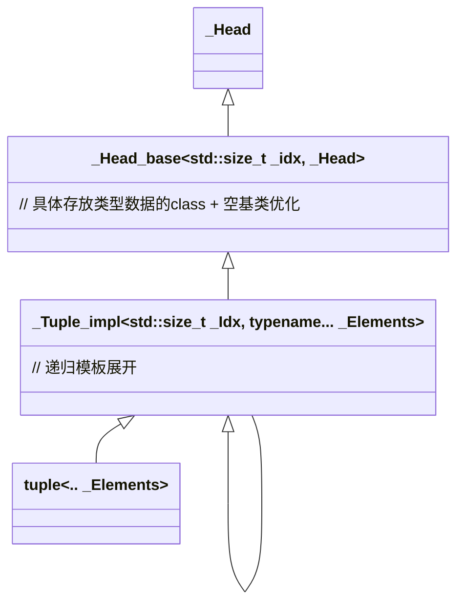

# std::tuple

> 📌本文使用wolai制作，原文链接： [std::tuple](https://www.wolai.com/Hjvft6ngqzZCouWeNywar)

分析环境: gcc 8.3.0

<!--more-->

# 1 类图




# 2 定义

`std::tuple`的模板声明


```c++
template <typename... _Elements> class tuple;


/// Primary class template, tuple
template <typename... _Elments>
class tuple : public _Tuple_impl<0, _Elements...> {
  typedef  _Tuple_impl <0, _Elements...> _Inherited;


```

支持变参模板, 且关键在其父类 `_Tuple_impl`

## `2.1 _Tuple_impl`

primary template声明:

```c++
/**
 * Contains the actual implementation of the @c tuple template, stored
 * as a recursive inheritance hierarchy from the first element (most
 * derived class) to the last (least derived class). The @c Idx
 * parameter gives the 0-based index of the element stored at this
 * point in the hierarchy; we use it to implement a constant-time
 * get() operation.
 */
template <std::size_t _Idx, typename... _Elements> struct _Tuple_impl;

```

偏特化处理1:


```c++
template <std::size_t _Idx, typename _Head, typename... _Tail>
struct _Tuple_impl<_Idx, _Head, _Tail...>
    : public _Tuple_impl<_Idx + 1, _Tail...>, private _Head_base<_Idx, _Head> {

```

递归模板，一次处理一个参数。结束条件在偏特化处理2:

```c++
// Basis case of inheritance recursion.
template <std::size_t _Idx, typename _Head>
struct _Tuple_impl<_Idx, _Head> : private _Head_base<_Idx, _Head> {

```

两个模板都没有自己的成员变量，都继承自 `_Head_base`:


## `2.2 _Head_base`

primary template声明:

```c++
template <std::size_t _Idx, typename _Head,
          bool =  __empty_not_final <_Head>::value>
struct _Head_base;
```

有个`type_trait`:

```c++
template <typename... _Elements> class tuple;

template <typename _Tp> struct __is_empty_non_tuple : is_empty<_Tp> {};

// Using EBO for elements that are tuples causes ambiguous base errors.
template <typename _El0, typename... _El>
struct __is_empty_non_tuple<tuple<_El0, _El...>> : false_type {};

// Use the Empty Base-class Optimization for empty, non-final types.
template <typename _Tp>
using __empty_not_final = typename conditional<__is_final(_Tp), false_type,
                                               __is_empty_non_tuple<_Tp>>::type;

```

一步步拆解这个 `__empty_not_final`的作用:

- `is_empty`， 这个是判定类型`_Tp`是否是一个空类。
- `__is_empty_non_tuple`: 判定类型`_Tp`是否是一个空类且还不是 `tuple`类型。 对于`tuple`类型，做了偏特化处理，结果一定是`false_type`

> 上述这个条件用于做 空基类优化(EBO)，对空类型而言可以节约内存。

- `__empty_not_final`: 判定类型`_Tp` 是否是一个空类且不是`tuple`类型且是否是`final`类（final类要么是基础类型，如int、float等，要么是自定义class加了final修饰）

现在很明确了，回到`_Head_base`的处理，`_Head_base`也有两个偏特化对应`__empty_not_final`是`true`，还是`false`：

### `2.2.1 __empty_not_final`为true

```c++
template <std::size_t _Idx, typename _Head>
struct _Head_base<_Idx, _Head, true> : public _Head {

```

说明`_Head`类型是空且可继承，所以true结果用继承方式处理。 这样可以应用[**EBO优化。**](https://www.wolai.com/Hjvft6ngqzZCouWeNywar#SGyhJ3xtG23rpLBcMkwp6 "EBO优化。")

### `2.2.2 __empty_not_final`为false

```c++
template <std::size_t _Idx, typename _Head>
struct _Head_base<_Idx, _Head, false> {
  constexpr _Head_base() : _M_head_impl() {}

  ...
   _Head _M_head_impl;

};
```

说明`_Head`类型是非空或者是final不可继承，这种情况作为成员变量存在。

看到这里基本就知道`tuple`的实现了:

1. `_Tuple_impl` 作为`tuple`父类，用递归模板展开
2. `_Head_base` 作为 `Tuple_impl`的父类，用继承的方式来存储实际的类型，且采用了[EBO优化。](https://www.wolai.com/Hjvft6ngqzZCouWeNywar#SGyhJ3xtG23rpLBcMkwp6 "EBO优化。")

下面回到`tuple`类，看看常用的构造函数:

## `2.3 tuple`构造函数

空构造:

```c++
  typedef _Tuple_impl<0, _Elements...> _Inherited;

  constexpr tuple() : _Inherited() {}

```

空构造调用对应类型的默认构造函数。

有参构造:

```c++
  template <
      typename... _UElements,
      typename enable_if<
          _TMC<_UElements...>::template _MoveConstructibleTuple<
              _UElements...>() &&
              _TMC<_UElements...>::template _ImplicitlyMoveConvertibleTuple<
                  _UElements...>() &&
              (sizeof...(_Elements) >= 1),
          bool>::type = true>
  constexpr tuple(_UElements &&...__elements)
      : _Inherited(std::forward<_UElements>(__elements)...) {}

```

抛开`enable_if`不分析，实际上就是一个完美转发构造。转发到`_Tuple_impl`

```c++
  template <typename _UHead, typename... _UTail,
            typename =
                typename enable_if<sizeof...(_Tail) == sizeof...(_UTail)>::type>
  explicit constexpr _Tuple_impl(_UHead &&__head, _UTail &&...__tail)
      : _Inherited(std::forward<_UTail>(__tail)...),
        _Base(std::forward<_UHead>(__head)) {}

```

这里实际上就是逐层构造，每次构造头部的类型， 直到走到叶子节点([偏特化的那个版本](https://www.wolai.com/Hjvft6ngqzZCouWeNywar#g2UmGQnTVxNJSPDbyCPEt7 "偏特化的那个版本"))的的构造函数：

```c++
  template <typename _UHead>
  explicit constexpr _Tuple_impl(_UHead &&__head)
      : _Base(std::forward<_UHead>(__head)) {}

```

## `2.4 get` 函数

`tuple`的成员是通过 `std::get<idx>(tuple)`来获取的。看下实现:

```c++
/// Return a reference to the ith element of a tuple.
template <std::size_t __i, typename... _Elements>
constexpr __tuple_element_t<__i, tuple<_Elements...>> &
get(tuple<_Elements...> &__t) noexcept {
  return std::__get_helper<__i>(__t);
}

/// Return a const reference to the ith element of a const tuple.
template <std::size_t __i, typename... _Elements>
constexpr const __tuple_element_t<__i, tuple<_Elements...>> &
get(const tuple<_Elements...> &__t) noexcept {
  return std::__get_helper<__i>(__t);
}

/// Return an rvalue reference to the ith element of a tuple rvalue.
template <std::size_t __i, typename... _Elements>
constexpr __tuple_element_t<__i, tuple<_Elements...>> &&
get(tuple<_Elements...> &&__t) noexcept {
  typedef __tuple_element_t<__i, tuple<_Elements...>> __element_type;
  return std::forward<__element_type &&>(std::get<__i>(__t));
}

/// Return a const rvalue reference to the ith element of a const tuple rvalue.
template <std::size_t __i, typename... _Elements>
constexpr const __tuple_element_t<__i, tuple<_Elements...>> &&
get(const tuple<_Elements...> &&__t) noexcept {
  typedef __tuple_element_t<__i, tuple<_Elements...>> __element_type;
  return std::forward<const __element_type &&>(std::get<__i>(__t));
}


```

最后都是通过`std::__get_helper`\`完成的:

```c++
template <std::size_t __i, typename _Head, typename... _Tail>
constexpr _Head &__get_helper(_Tuple_impl<__i, _Head, _Tail...> &__t) noexcept {
  return _Tuple_impl<__i, _Head, _Tail...>::_M_head(__t);
}

template <std::size_t __i, typename _Head, typename... _Tail>
constexpr const _Head &
__get_helper(const _Tuple_impl<__i, _Head, _Tail...> &__t) noexcept {
  return _Tuple_impl<__i, _Head, _Tail...>::_M_head(__t);
}


```

转调用`_Tuple_impl`的`_M_head`函数。

```c++
  static constexpr _Head &_M_head(_Tuple_impl &__t) noexcept {
    return _Base::_M_head(__t);
  }

  static constexpr const _Head &_M_head(const _Tuple_impl &__t) noexcept {
    return _Base::_M_head(__t);
  }

```

# 3 空基类优化(EBO)

C++ 的空基类优化 (Empty Base Optimization, EBO) 是一种编译器优化，它允许从空基类派生的类的大小为零。这意味着如果一个类只继承自一个空基类，并且没有添加任何自己的成员变量，那么该类的对象大小将不会增加。这可以显著减少内存消耗，尤其是在处理大量对象时。

**EBO 的工作原理:**

C++ 标准规定，即使是空类也必须占用至少一个字节的内存，以保证不同对象的地址不同。然而，当一个空类作为另一个类的基类时，编译器可以优化掉空基类在派生类中的空间占用。这被称为空基类优化。

**EBO 的使用场景:**

EBO 最常用于策略模式 (Strategy Pattern) 和模板元编程 (Template Metaprogramming) 中。在策略模式中，可以使用空基类来表示不同的策略，而派生类则实现具体的策略。通过 EBO，可以避免由于策略类的大小而导致的内存浪费。在模板元编程中，EBO 可以帮助减少模板实例化的大小。

**EBO 的限制:**

EBO 并非总是有效的。以下是一些限制条件：

- **虚拟继承:** 如果使用虚拟继承，则 EBO 可能无效。虚拟继承会引入额外的虚表指针，从而增加对象的大小。
- **非空基类:** 如果基类不是空的，则 EBO 也可能无效。
- **成员变量:** 如果派生类添加了自己的成员变量，则 EBO 仍然会减少内存占用，但不会完全消除基类的大小。
- **编译器实现:** EBO 的实现依赖于编译器，不同的编译器可能会有不同的行为。

举个例子说明EBO的作用，不使用EBO优化:

```c++
#include <iostream>

struct Empty{};

template <typename T1, typename T2>
struct SimpleTuple {
  T1 first;
  T2 second;
};

int main() {
  std::cout << "Size of SimpleTuple<int, int>: " << sizeof(SimpleTuple<int, int>) << std::endl;  // 输出8
  std::cout << "Size of SimpleTuple<int, void>: " << sizeof(SimpleTuple<int, Empty>) << std::endl; // Empty 仍然占用空间， 输出8
  return 0;
}

```

在这个例子中，`SimpleTuple` 直接包含成员变量。即使 `second` 是 `Empty` 类型，它仍然会占用空间（通常为 1 字节，以保证不同对象的地址不同）。

使用EBO:

```c++
#include <iostream>
#include <type_traits>

struct Empty {};

template <typename T1, typename T2>
struct SimpleTupleEBO : public std::conditional_t<std::is_empty_v<T2>, Empty, T2> {
  T1 first;
};

int main() {
  std::cout << "Size of SimpleTupleEBO<int, int>: " << sizeof(SimpleTupleEBO<int, Empty>) << std::endl;  // 输出4
  return 0;
}

```

`SimpleTupleEBO` 使用条件继承。如果 `T2` 是空类型，则继承自 `Empty`；否则，直接包含 `T2` 作为成员。 编译器 *可能* 会对 `SimpleTupleEBO<int, Empty>` 应用 EBO，使得 `Empty` 不占用空间。


# 4 总结

本文档介绍了C++标准库中的`std::tuple`容器的实现细节，包括类图、模板声明以及其内部机制的工作原理。`std::tuple`是一个泛型序列容器，用于存储一系列不同类型的数据。它的实现基于模板类和递归模板，利用`_Tuple_impl`结构体作为其核心，同时采用空基类优化（EBO）来提高效率。

`_Tuple_impl`模板通过递归实现，每个层级对应`std::tuple`中的一个元素，其中包含了元素的实际类型信息及其在序列中的索引。`_Head_base`类进一步优化存储，根据元素类型的不同采用不同的存储方式：对于空类型或final不可继承的类型，采用继承的方式存储；对于其他类型则作为成员变量存储，以支持空基类优化。

文档还详细讨论了`std::tuple`的关键操作，包括构造函数以及`std::get`函数的实现，这些操作均通过`_Tuple_impl`和相关辅助函数来完成。

此外，文档简要介绍了C++中的空基类优化（EBO），这是一种编译器优化技术，可以使从空基类派生的类的对象大小为零，从而节省内存。`std::tuple`的实现就充分利用了这一优化，特别是在元素类型之一为空类型的情况下。

最后，文档通过示例展示了EBO的应用，对比了不使用EBO与使用EBO时`SimpleTuple`类的大小差异，直观地体现了EBO如何减少内存消耗。
e
