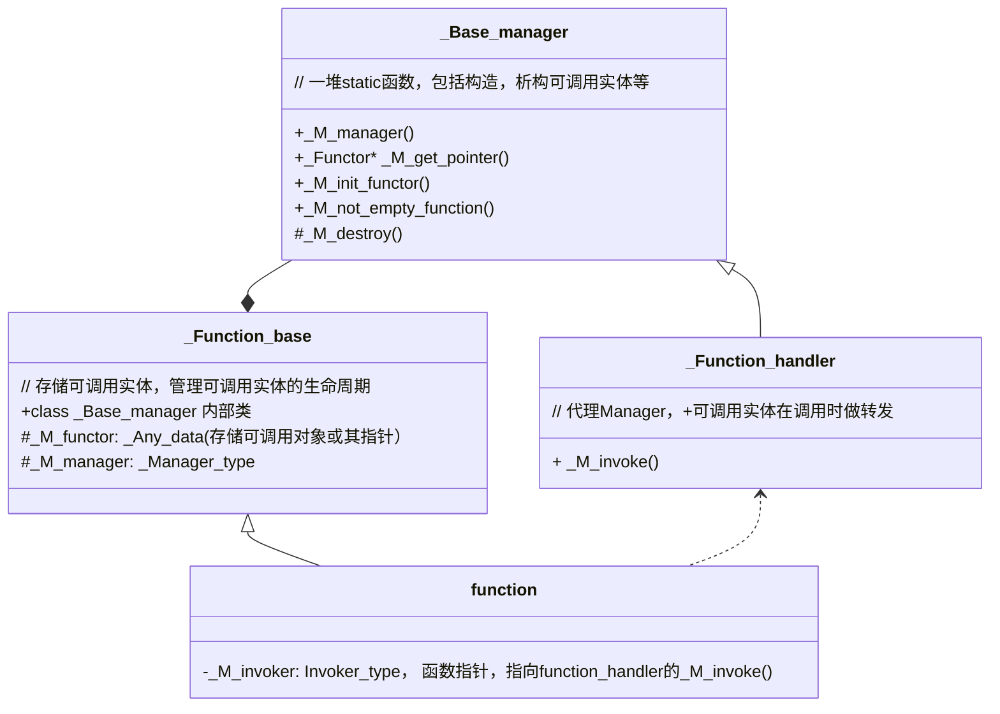

## 目录

本文原文link: https://www.wolai.com/8FYKXwcp1ozZnwXc6ThL75#rZ6NcsSCroiH83XhoKSaGB

<!--more-->


## 1 类图



## 2 function的定义

```c++
  /**
   *  @brief Primary class template for std::function.
   *  @ingroup functors
   *
   *  Polymorphic function wrapper.
   */
  template<typename _Res, typename... _ArgTypes>
    class function<_Res(_ArgTypes...)>
    : public _Maybe_unary_or_binary_function<_Res, _ArgTypes...>,
      private _Function_base

```

父类有两个 `_Maybe_unary_or_binary_function` 和 `_Function_base`

模板参数分别是代表返回值的 `_Res` 和 代表参数的 `..._ArgTypes`

## 3 \_Function\_base

定义如下:

```c++
  /// Base class of all polymorphic function object wrappers.
  class _Function_base
  {
  public:
    static const std::size_t _M_max_size = sizeof(_Nocopy_types);
    static const std::size_t _M_max_align = __alignof__(_Nocopy_types);

    template<typename _Functor>
      class _Base_manager {
      ...
      };

    _Function_base() : _M_manager(nullptr) { }

    ~_Function_base()
    {
      if (_M_manager)
  _M_manager(_M_functor, _M_functor, __destroy_functor);
    }

    bool _M_empty() const { return !_M_manager; }

    typedef bool (*_Manager_type)(_Any_data&, const _Any_data&,
          _Manager_operation);

    _Any_data     _M_functor;
    _Manager_type _M_manager;
}
```

有两个成员变量，一个是`_M_functor`，类型是 `_Any_data`, 另一个是 `_M_manager`，类型是 `_Manager_type`

```c++
    typedef bool (*_Manager_type)(_Any_data&, const _Any_data&,
          _Manager_operation);
```

### `3.1 _Any_data`

先看类型 `_Any_data`:

```c++
  union _Nocopy_types  // 代表可调用的类型
  {
    void*       _M_object;    // 可调用对象
    const void* _M_const_object;  //  可调用的常量对象
    void (*_M_function_pointer)(); // 函数指针
    void (_Undefined_class::*_M_member_pointer)(); // 成员函数指针， 可能占用16B 
  };

  union [[gnu::may_alias]] _Any_data  // 取消编译器别名优化
  {
    void*       _M_access()       { return &_M_pod_data[0]; }
    const void* _M_access() const { return &_M_pod_data[0]; }

    template<typename _Tp>
      _Tp&
      _M_access()   // 获取底层可调用实体的引用
      { return *static_cast<_Tp*>(_M_access()); }

    template<typename _Tp>
      const _Tp&
      _M_access() const // 获取底层可调用实体的const引用
      { return *static_cast<const _Tp*>(_M_access()); }

    _Nocopy_types _M_unused;
    char _M_pod_data[sizeof(_Nocopy_types)];   // 对于_Nocopy_types，由于它是一个union，只能返回激活对象，否则是UB行为，这里用_M_pod_data占用，返回上述access函数返回第一个字节，保证一定返回的是可调用对象的首地址
  };


```

`_Any_data`代表可调用对象。内部封装了四种可调用类型。&#x20;

`sizeof(_Any_data)` 为16字节，因为成员函数指针的大小可能是16B。

`alignof(_Any_data)` 为8字节，平台(gcc 8.3, intel 64位架构）

### `3.2 _Base_manager`

后续一节中会使用到本class，本节先介绍。

#### `3.2.1 _M_not_empty_function`

判定传入的function 是否为空，针对不同可调用类型，做了几个重载。

```c++
    template <typename _Signature>  // 本身就是function
    static bool _M_not_empty_function(const function<_Signature> &__f) {
      return static_cast<bool>(__f); 
    }
    
    // 函数指针
    template <typename _Tp> static bool _M_not_empty_function(_Tp *__fp) {
      return __fp != nullptr;
    }
  
    // 成员函数
    template <typename _Class, typename _Tp>
    static bool _M_not_empty_function(_Tp _Class::*__mp) {
      return __mp != nullptr;
    }
    
    // 常量functor引用， 应该是对应functor
    template <typename _Tp> static bool _M_not_empty_function(const _Tp &) {
      return true;
    }
```

#### `3.2.2 _M_init_functor`

初始化functor：

```c++
protected:
    static void _M_init_functor(_Any_data &__functor, _Functor &&__f) {
      _M_init_functor(__functor, std::move(__f), _Local_storage());
    }

private:
  static void _M_init_functor(_Any_data &__functor, _Functor &&__f,
                              true_type) {
    ::new (__functor._M_access()) _Functor(std::move(__f));
  }

  static void _M_init_functor(_Any_data &__functor, _Functor &&__f,
                              false_type) {
    __functor._M_access<_Functor *>() = new _Functor(std::move(__f));
  }


```

这里根据是否能 `_Local_storage` 路由到不同的`private`函数中。

如果能`local storage`, 则在传入的`_Any_data` functor内部直接`placement new`一个`_Functor`，否则在`heap`上直接new，然后`_Any_data`内部的指针指向这个`heap` new出来的对象。

这里的`_Local_storage`如何实现的？

```c++
  static const std::size_t _M_max_size = sizeof(_Nocopy_types);
  static const std::size_t _M_max_align = __alignof__(_Nocopy_types);
   
    static const bool __stored_locally =
        (__is_location_invariant<_Functor>::value &&
         sizeof(_Functor) <= _M_max_size &&
         __alignof__(_Functor) <= _M_max_align &&
         (_M_max_align % __alignof__(_Functor) == 0));

    typedef integral_constant<bool, __stored_locally> _Local_storage;

```

本质上用的`integral_constant`, 为true\_type的条件是:

- `__is_location_invariant`, 实际上就是 `__is_trivially_copyable`
- sizeof functor不能超过 `_M_max_size`, 即: sizeof(\_Nocopy\_types), 也即 sizeof(\_Any\_data),  通常是16字节。&#x20;
- alignof functor是小于等于 alignof \_Nocopy\_types, 即8字节。且可按8字节整除。

> 强调下，这里的alignof，sizeof都是平台相关的，不同平台可能不一样。

这些限制都是为了functor能够`placement new` 到 `_Any_data`上，避免多一次内存申请开销。

### `3.3 _M_destroy`

根据是否`local storage`调用对应的析构函数:

```c++
    // Destroying a location-invariant object may still require
    // destruction.
    static void _M_destroy(_Any_data &__victim, true_type) {
      __victim._M_access<_Functor>().~_Functor();
    }

    // Destroying an object located on the heap.
    static void _M_destroy(_Any_data &__victim, false_type) {
      delete __victim._M_access<_Functor *>();
    }
```

### `3.4 _M_get_pointer`

获取 `source` 中存放的可调用对象指针。

```c++
    // Retrieve a pointer to the function object
    static _Functor *_M_get_pointer(const _Any_data &__source) {
      const _Functor *__ptr =
          __stored_locally ? std::__addressof(__source._M_access<_Functor>())
                           /* have stored a pointer */
                           : __source._M_access<_Functor *>();
      return const_cast<_Functor *>(__ptr);
    }

```

如果`__source`中存放的可调用对象是存放在本地的，则直接返回该对象的地址（这里必须用`std::__addressof`， 因为&可能被重载了）。如果不是，则返回指针。

### `3.5 _M_manager`

一个function管理类：

```c++
enum _Manager_operation {
  __get_type_info,
  __get_functor_ptr,
  __clone_functor,
  __destroy_functor
};


  static bool _M_manager(_Any_data &__dest, const _Any_data &__source,
                         _Manager_operation __op) {
    switch (__op) {
#if __cpp_rtti
    case __get_type_info:
      __dest._M_access<const type_info *>() = &typeid(_Functor);
      break;
#endif
    case __get_functor_ptr:
      __dest._M_access<_Functor *>() = _M_get_pointer(__source);
      break;

    case __clone_functor:
      _M_clone(__dest, __source, _Local_storage());
      break;

    case __destroy_functor: 
      _M_destroy(__dest, _Local_storage());
      break;
    }
    return false;
  }


```

## `4 _Function_handler`

function\_handler是一个代理类，负责可调用实体在调用时的转发。

声明如下:

```c++
template <typename _Signature, typename _Functor> class _Function_handler;


template <typename _Res, typename _Functor, typename... _ArgTypes>
class _Function_handler<_Res(_ArgTypes...), _Functor>
    : public _Function_base::_Base_manager<_Functor> {
  typedef _Function_base::_Base_manager<_Functor> _Base;

public:
  static _Res _M_invoke(const _Any_data &__functor, _ArgTypes &&...__args) {
    return (*_Base::_M_get_pointer(__functor))(
        std::forward<_ArgTypes>(__args)...);
  }
};

...

// 还有几种模板偏特化


```

继承自 `_Function_base::_Base_manager`，拥有构造、析构可调用实体的能力。

内部只有一个`_M_invoke`函数，通过`_M_get_pointer`获取可调用实体的指针，然后执行`forward` args来调用。

### 4.1 偏特化1 - void 类型返回值

void前不用return

```c++
template <typename _Functor, typename... _ArgTypes>
class _Function_handler<void(_ArgTypes...), _Functor>
    : public _Function_base::_Base_manager<_Functor> {
  typedef _Function_base::_Base_manager<_Functor> _Base;

public:
  static void _M_invoke(const _Any_data &__functor, _ArgTypes &&...__args) {
    (*_Base::_M_get_pointer(__functor))(std::forward<_ArgTypes>(__args)...);
  }
};


```

### 4.2 偏特化2 - 成员函数

成员函数不能简单像primary template那样调用:

```c++
template <typename _Class, typename _Member, typename _Res,
          typename... _ArgTypes>
class _Function_handler<_Res(_ArgTypes...), _Member _Class::*>
    : public _Function_handler<void(_ArgTypes...), _Member _Class::*> {
  typedef _Function_handler<void(_ArgTypes...), _Member _Class::*> _Base;

public:
  static _Res _M_invoke(const _Any_data &__functor, _ArgTypes &&...__args) {
    return std::__invoke(_Base::_M_get_pointer(__functor)->__value,
                         std::forward<_ArgTypes>(__args)...);
  }
};

```

用`std::invoke`包装了一层, `std::invoke`可以处理所有函数。

> 为什么不直接用`std::invoke` 处理primary template？是因为`std::invoke`有额外开销吗？

## 5 function 构造函数

这里只分析常用构造函数，即传入一个Functor:

```c++
  /**
   *  @brief Builds a %function that targets a copy of the incoming
   *  function object.
   *  @param __f A %function object that is callable with parameters of
   *  type @c T1, @c T2, ..., @c TN and returns a value convertible
   *  to @c Res.
   *
   *  The newly-created %function object will target a copy of
   *  @a __f. If @a __f is @c reference_wrapper<F>, then this function
   *  object will contain a reference to the function object @c
   *  __f.get(). If @a __f is a NULL function pointer or NULL
   *  pointer-to-member, the newly-created object will be empty.
   *
   *  If @a __f is a non-NULL function pointer or an object of type @c
   *  reference_wrapper<F>, this function will not throw.
   */
  template <typename _Functor,
            typename = _Requires<__not_<is_same<_Functor, function>>, void>,
            typename = _Requires<_Callable<_Functor>, void>>
  function(_Functor);
  

```

> `_Requires`实际上就是`enable_if`
>
> ```c++
> template <typename _Cond, typename _Tp>
> using _Requires = typename enable_if<_Cond::value, _Tp>::type;
> 
> ```

这是一个模板构造函数, 模板生效条件是:

1. 传入Functor不能本身就是function(不然就是拷贝构造函数了)
2. 传入的Functor本身要是 `_Callable`的

`_Callable`相关的定义如下:

```c++
        template<typename _From, typename _To>
    using __check_func_return_type
      = __or_<is_void<_To>, is_same<_From, _To>, is_convertible<_From, _To>>;

      
      template<typename _Func,
         typename _Res2 = typename result_of<_Func&(_ArgTypes...)>::type>
  struct _Callable : __check_func_return_type<_Res2, _Res> { };

      // Used so the return type convertibility checks aren't done when
      // performing overload resolution for copy construction/assignment.
      template<typename _Tp>
  struct _Callable<function, _Tp> : false_type { };

```

> result\_of 得到 Func调用的返回类型（注意这里Func后面必须跟&, 这是result\_of的弊端，c++17之后推荐使用invole\_result)。

`_Callable` 检测 `std::function`传入的返回值和`Func`函数调用后的返回值是否相同(或者是void类型，又或者可能隐私转换），如果相同 `_Callable`持有`value=true`，否则`value=false`

回到构造函数实现:

```c++
  // 实现
  template <typename _Res, typename... _ArgTypes>
template <typename _Functor, typename, typename>
function<_Res(_ArgTypes...)>::function(_Functor __f) : _Function_base() {
  typedef _Function_handler<_Res(_ArgTypes...), _Functor> _My_handler;

  if (_My_handler::_M_not_empty_function(__f)) {
    _My_handler::_M_init_functor(_M_functor, std::move(__f));
    _M_invoker = &_My_handler::_M_invoke;
    _M_manager = &_My_handler::_M_manager;
  }
}

```

首先构造基类。 接着对 `_Function_handler` 做了`typedef`。

调用 `_M_not_empty_function`，如果非空，再调用`_M_init_functor`, 这一步执行完后：
`_M_functor` 要么本身就存储了 `__f`的信息（只要`__f`本身满足 [local storage](https://www.wolai.com/8FYKXwcp1ozZnwXc6ThL75#a3DNLwWKNH4LSZ5gNPjMSd "local storage") 的要求。要么指向一个新`new`出来的`__f`对象。

接着， 函数指针 `_M_invoker` 指向了 [\_My\_handler::\_M\_invoke](https://www.wolai.com/8FYKXwcp1ozZnwXc6ThL75#rZ6NcsSCroiH83XhoKSaGB "_My_handler::_M_invoke"). `_M_manager`指向 [\_My\_handler::\_M\_manager](https://www.wolai.com/8FYKXwcp1ozZnwXc6ThL75#tcNQNy6PmQdDT2KsJH9VTJ "_My_handler::_M_manager")函数。

## 6 function调用 —  operator()

函数定义如下：

```c++
  /**
   *  @brief Invokes the function targeted by @c *this.
   *  @returns the result of the target.
   *  @throws bad_function_call when @c !(bool)*this
   *
   *  The function call operator invokes the target function object
   *  stored by @c this.
   */
  _Res operator()(_ArgTypes... __args) const;

template <typename _Res, typename... _ArgTypes>
_Res function<_Res(_ArgTypes...)>::operator()(_ArgTypes... __args) const {
  if (_M_empty())
    __throw_bad_function_call();
  return _M_invoker(_M_functor, std::forward<_ArgTypes>(__args)...);
}

```

这个没什么好说的，只要function不为空，则转发调用。

## 7 function析构

ffunction本身没有析构函数, 查看其基类 `Function_base` 的析构:

```c++
  ~_Function_base() {
    if (_M_manager)
      _M_manager(_M_functor, _M_functor, __destroy_functor);
  }

```

我们在 [这里](https://www.wolai.com/8FYKXwcp1ozZnwXc6ThL75#prskJUKrK4u83EdCTxdgRU "这里") 提到了 `_M_manager`， 实际上最终进入 `_M_destroy`

## 8 总结

本文档介绍了C++标准库中的std::function类及其相关概念。std::function提供了一种通用的方式来包装任何可调用的对象，并支持动态绑定。文档首先定义了一个基础类_Function_base，用于存储可调用的对象或其指针，同时提供管理其生命周期的函数。接着，function类作为_Function_base的子类，提供了对可调用对象的操作，如调用和传递参数。
_Function_base包含两个主要成员变量：_M_functor用于存储可调用的对象或其指针，而_M_manager则指向管理_M_functor生命周期的管理类。管理类_Base_manager提供了诸如创建、复制、销毁和查询类型信息等功能。
_Function_handler是一个简单的代理类，用于在调用时转发给定的_M_functor。它从_Function_base继承并添加了一个仅有的成员函数_M_invoke，该函数通过_M_get_pointer获取_M_functor的指针，然后调用相应的函数。
文档还详细讨论了function类的常见构造方式，特别是当传入一个可调用对象（例如函数指针或成员函数指针）时的情况。
总体来说，std::function的设计允许用户以一种类型安全的方式处理可调用对象，同时也提供了一套机制来确保这些对象能够在运行时正确地进行动态绑定和管理。
