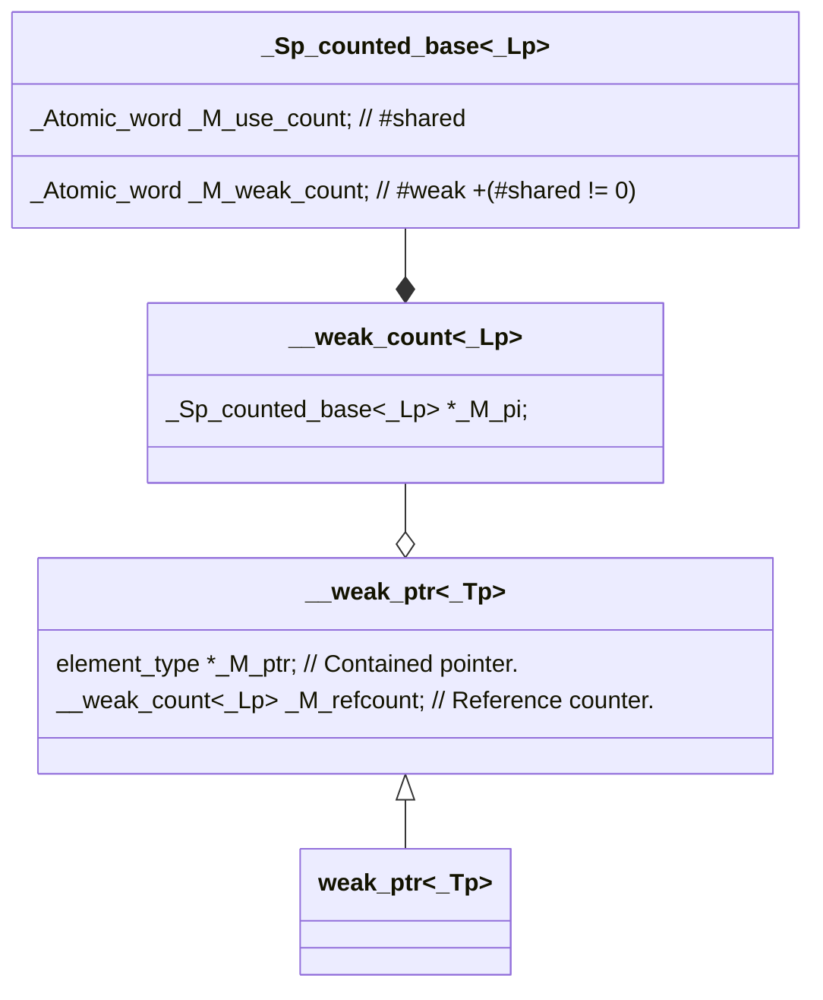

> 📌本文采用wolai制作，原文[ 链接](https://www.wolai.com/ravenxrz/psEd7sLcmw2L9Nu3uHMfPr " 链接") &#x20;

前文介绍了 [std::shared\_ptr](https://www.wolai.com/w8mFh9W9xfoz12i5ENRv74 "std::shared_ptr"),  注意到在中解释 [enable\_shared\_from\_this](https://www.wolai.com/ravenxrz/w8mFh9W9xfoz12i5ENRv74#jhq92yJnKVJzjStdnJBTzc "enable_shared_from_this")的实现原理中，提到了`weak_ptr`。今天继续看`weak_ptr`的实现。

<!--more-->

# 1 什么是weak\_ptr? 有什么作用？

相比 [std::unique\_ptr](https://www.wolai.com/5kf4Mci5ETPySzSafqkAiS "std::unique_ptr")和[std::shared\_ptr](https://www.wolai.com/w8mFh9W9xfoz12i5ENRv74 "std::shared_ptr")，`std::weak_ptr`的使用场景比较少。除了 `enable_shared_from_this`中使用到以外，`std::weak_ptr`最长用的场景是**解除shared\_ptr的循环依赖问题。**

举个例子：


```c++
#include <iostream>
#include <memory>

class B; // 前向声明

class A {
public:
  std::shared_ptr<B> ptrB;
  ~A() { std::cout << "A destroyed" << std::endl; }
};

class B {
public:
  std::shared_ptr<A> ptrA;
  ~B() { std::cout << "B destroyed" << std::endl; }
};

int main() {
  // 创建两个 shared_ptr，分别指向 A 和 B 对象
  std::shared_ptr<A> a = std::make_shared<A>();
  std::shared_ptr<B> b = std::make_shared<B>();
  // 建立循环引用
  a->ptrB = b;
  b->ptrA = a;
  return 0;
}

```

A和B对象相互易用，这导致main函数退出时，a和b对象没有析构，两个析构函数都没有打印，导致内存泄露。为了解决这个问题，可引入`weak_ptr`

```c++
#include <iostream>
#include <memory>

class B; // 前向声明

class A {
public:
    std::shared_ptr<B> ptrB;
    ~A() {
        std::cout << "A destroyed" << std::endl;
    }
};

class B {
public:
     std::weak_ptr<A> ptrA; // 使用 weak_ptr 避免循环引用
     ~B() {
        std::cout << "B destroyed" << std::endl;
    }
};

int main() {
    // 创建两个 shared_ptr，分别指向 A 和 B 对象
    std::shared_ptr<A> a = std::make_shared<A>();
    std::shared_ptr<B> b = std::make_shared<B>();

    // 建立循环引用
    a->ptrB = b;
    b->ptrA = a;

    // 离开作用域时，a 和 b 都会被正确销毁
    // 因为 b->ptrA 是 weak_ptr，不会增加引用计数
    return 0;
}
```

这是因为 `std::weak_ptr` 允许你持有一个对 `std::shared_ptr` 管理的对象的非拥有（non-owning）引用。它不会增加引用计数，从而避免了循环引用的问题。

# 2 类图



# 3 源码

`weak_ptr`的定义如下:

```c++
template <typename _Tp> class weak_ptr : public __weak_ptr<_Tp> {
...
}
```

看起来和`shared_ptr`类似，有一个父类。

## `3.1 __weak_ptr`

```c++
template <typename _Tp, _Lock_policy _Lp> class __weak_ptr {
  // ...
  element_type *_M_ptr;          // Contained pointer.
  __weak_count<_Lp> _M_refcount; // Reference counter.
};

```

和 `__shared_ptr`非常类似，有一个指向管理对象的raw pointer `_M_ptr`和引用引用计数对象 `_M_refcount`

### 3.1.1 构造函数&#x20;

#### 3.1.1.1 从`shared_ptr`中构造

```c++
  template <typename _Yp, typename = _Compatible<_Yp>>
  __weak_ptr(const __shared_ptr<_Yp, _Lp> &__r) noexcept
      : _M_ptr(__r._M_ptr), _M_refcount(__r._M_refcount) {}

```

初始化 `_M_ptr`和 `_M_refcount`。

看下 `_M_refcount`是如何构造的:

```c++
  template <_Lock_policy _Lp> class __weak_count {
  // ...
  __weak_count(const __shared_count<_Lp> &__r) noexcept : _M_pi(__r._M_pi) {
    if (_M_pi != nullptr)
      _M_pi->_M_weak_add_ref();
  }
  // ...

  _Sp_counted_base<_Lp> *_M_pi;
};

// _Sp_counted_base::
  void _M_weak_add_ref() noexcept {
    __gnu_cxx::__atomic_add_dispatch(&_M_weak_count, 1);
  }


```

`__weak_count` 本质上是一个指向控制块的指针，在初始化时，将控制块中的weak的引用计数部分+1。

> 回顾下控制块中的内容:
>
> ```c++
> template <_Lock_policy _Lp = __default_lock_policy>
> class _Sp_counted_base : public _Mutex_base<_Lp> {
> public:
>   _Sp_counted_base() noexcept
>       :  _M_use_count(1), _M_weak_count(1) {}
>
>         ...
>
>   _Atomic_word _M_use_count; // #shared
>   _Atomic_word _M_weak_count;      // #weak + (#shared != 0)
> };
> ```

### 3.1.2 \_M\_assign函数

这里再分析`_M_assign`函数，之前在解释 [enable\_shared\_from\_this](https://www.wolai.com/ravenxrz/w8mFh9W9xfoz12i5ENRv74#o2QFrVwLodcueA8fMJLuke "enable_shared_from_this")原理时，看了这个函数，这里重新再看下。

```c++
  // __weak_ptr::
  // Used by __enable_shared_from_this.
  void _M_assign(_Tp *__ptr, const __shared_count<_Lp> &__refcount) noexcept {
    if (use_count() == 0) {
      _M_ptr = __ptr;
      _M_refcount = __refcount;
    }
  }

```

- `__ptr`为继承自`enable_shared_from_this`的类的对象
- `__ref_count`为`shared_ptr`的控制块计数。

上述代码表示，如果当前`weak_ptr`是空（没有控制块），或者指向的控制块的强引用是0， 则将管理指针和控制块计数重新复制。

> 📌思考： 如果`weak_ptr`不是空，曾经指向过其他控制块，该控制块有强引用，此时调用`_M_assign`岂不是没有作用？
> 目前回答： `_M_assign`是private的函数，是`enable_shared_from_this`的友元函数，所以能够调用本函数的，一定是很清楚`weak_ptr`的内部机制的，同时目前笔者看到的只有在`enable_shared_from_this`中才会用到，`enable_shared_from_this`的weak\_ptr只有在`shared_ptr`构造的时候才会初始化，此时的`used_count`一定是0，所以也不存在问题。
> 但是如果这样思考，为什么不加个`assert`或者抛异常?


### 3.1.3 expired

Returns whether the [weak\_ptr](https://cplusplus.com/weak_ptr "weak_ptr") object is either *empty* or there are no more [shared\_ptr](https://cplusplus.com/shared_ptr "shared_ptr") in the *owner group* it belongs to.

```c++
// __weak_ptr实现：
bool expired() const noexcept { return _M_refcount._M_get_use_count() == 0; }

// 转到 __weak_count 实现:
long _M_get_use_count() const noexcept {
  return _M_pi != nullptr ? _M_pi->_M_get_use_count() : 0;
}

// 转到 _Sp_counted_base
long _M_get_use_count() const noexcept {
  // No memory barrier is used here so there is no synchronization
  // with other threads.
  return __atomic_load_n(& _M_use_count , __ATOMIC_RELAXED);
}
```

### 3.1.4 lock

Returns a shared\_ptr with the information preserved by the weak\_ptr object if it is not expired.


```c++
// __weak_ptr
__shared_ptr<_Tp, _Lp> lock() const noexcept {
  return __shared_ptr<element_type, _Lp>(*this, std::nothrow);
}

```

这个转到`__shared_ptr`用`__weak_ptr`构造函数:

> 本段为引用：
>
> 除了raw pointer和 拷贝、移动构造以外，还可以从`weak_ptr`构造:
>
> ```c++
> /**
>  *  @brief  Constructs a %shared_ptr that shares ownership with @a __r
>  *          and stores a copy of the pointer stored in @a __r.
>  *  @param  __r  A weak_ptr.
>  *  @post   use_count() == __r.use_count()
>  *  @throw  bad_weak_ptr when __r.expired(),
>  *          in which case the constructor has no effect.
>  */
> template <typename _Yp, typename = _Constructible<const weak_ptr<_Yp> &>>
> explicit shared_ptr(const weak_ptr<_Yp> &__r) : __shared_ptr<_Tp>(__r) {}
>
> ```
>
> 转到`__shared_ptr`
>
> ```c++
> // This constructor is used by __weak_ptr::lock() and
> // shared_ptr::shared_ptr(const weak_ptr&, std::nothrow_t).
> __shared_ptr(const __weak_ptr<_Tp, _Lp> &__r, std::nothrow_t)
>     : _M_refcount(__r._M_refcount, std::nothrow) {
>   _M_ptr = _M_refcount._M_get_use_count() ? __r._M_ptr : nullptr;
> }
>  __shared_ptr
> ```
>
>
>
> 拿到`weak`的`_M_refcount`构造 shared\_ptr的`_M_refcount`。 同时初始化`_M_ptr`指针。

只要`weak_ptr`的`refcount`的强引用不是0，则返回对象指针，否则构造为`nullptr`


# 4 总结

本文档介绍了C++标准库中的`std::weak_ptr`类及其在解决循环引用问题中的应用。相比于`std::unique_ptr`和`std::shared_ptr`，`std::weak_ptr`的使用场景较为有限，其中一个主要用途是避免循环引用。本文通过一个简单的示例，展示了当两个对象互相持有对方的`std::shared_ptr`时可能导致的内存泄漏问题，并说明了如何使用`std::weak_ptr`来打破这种循环，确保对象能够被正确销毁。

文档还深入探讨了`std::weak_ptr`的实现细节，包括其类图结构、成员变量、构造函数和重要方法（如`expired()`、`lock()`等）。特别地，`lock()`方法用于获取一个共享所有权的智能指针，只有当`std::weak_ptr`有效且未过期时才返回非空结果。此外，讨论还包括了`std::weak_ptr`与`enable_shared_from_this`类之间的交互方式。

