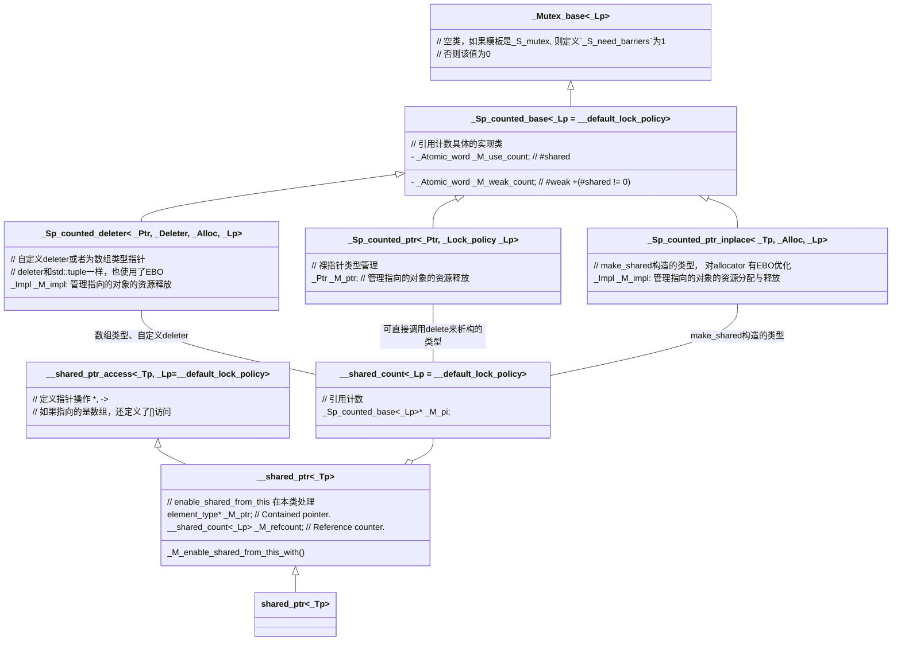

> 📌本文采用wolai制作，原文link: [https://www.wolai.com/ravenxrz/w8mFh9W9xfoz12i5ENRv74](https://www.wolai.com/ravenxrz/w8mFh9W9xfoz12i5ENRv74 "https://www.wolai.com/ravenxrz/w8mFh9W9xfoz12i5ENRv74")

前文介绍了 [std::unique\_ptr](https://www.wolai.com/5kf4Mci5ETPySzSafqkAiS "std::unique_ptr")，本文继续分析另一个常用的智能指针: std::shared\_ptr

<!--more-->

# 1 TODO

- [ ] [std::shared\_ptr析构释放资源时的 ](https://www.wolai.com/ravenxrz/w8mFh9W9xfoz12i5ENRv74#vtrkYGdUDkXuf9mVKuRSnB "std::shared_ptr析构释放资源时的 ")[fence](https://www.wolai.com/ravenxrz/w8mFh9W9xfoz12i5ENRv74#vtrkYGdUDkXuf9mVKuRSnB "fence")[的作用](https://www.wolai.com/ravenxrz/w8mFh9W9xfoz12i5ENRv74#vtrkYGdUDkXuf9mVKuRSnB "的作用")
- [ ] [std::enable\_shared\_from\_this 中的 ](https://www.wolai.com/ravenxrz/w8mFh9W9xfoz12i5ENRv74#8XWeNjJT7rHZMdnxyW2nUq "std::enable_shared_from_this 中的 ")[week\_ptr](https://www.wolai.com/ravenxrz/w8mFh9W9xfoz12i5ENRv74#8XWeNjJT7rHZMdnxyW2nUq "weak_ptr")[构造详细分析](https://www.wolai.com/ravenxrz/w8mFh9W9xfoz12i5ENRv74#8XWeNjJT7rHZMdnxyW2nUq "构造详细分析")

# 2 预计解答的问题

1. `std::shared_ptr` 操作是否为线程安全

> 📌即使从拷贝构造函数看，拷贝构造中的 `_M_ptr`和 `_M_refcount` 赋值是分开的，所以拷贝构造一个`shared_ptr`不是线程安全的。但是`_M_refcount`本身的[加减是原子的](https://www.wolai.com/ravenxrz/w8mFh9W9xfoz12i5ENRv74#rDw6vhmUUAfjfaNt2Lneoh "加减是原子的")，内部是一个原子变量。

2. `std::shared_ptr`内存空间占用

> 📌见：内存占用， 简单总结， sizeof(std::shared\_ptr) =16B。 但即使是最简单的 raw pointer构造出来的std::shared\_ptr，总内存占用也至少是40B。如果是`std::make_shared`或者有自定义的deleter构造出来的，内存占用可能更多。

3. 使用`raw_pointer`来构造`std::shared_ptr`和`make_shared`的区别

> 📌make\_shared和直接raw pointer相比，区别在于内存分配上：
> 1\. make\_shared对象的管理块（引用计数，allocator）和对象本身的内存分配只有一次
> 2\. raw\_pinter首先要分配需要管理的对象，再分配对象管理块（引用计数，deleter）

4. `enable_shared_from_this`实现原理

1. enable\_shared\_from\_this, 本质上就是一个 private 的`weak_ptr`
2. 这个`weak_ptr`的初始化由  `shared_ptr` 构造时初始化（而不是继承它的类型对象初始化），初始化时，`weak_ptr `控制块指向`shared_ptr `的控制块，且`weak_ptr`也持有要管理的指针。
3. 当调用`shared_from_this`时，通过这个`weak_ptr`来构造一个`shared_ptr`，这个新的`shared_ptr`就能够共享原来最初的控制块。

# 3 类图



# 4 源码

shared\_ptr 定义如下:

```c++
template <typename _Tp> class shared_ptr : public __shared_ptr<_Tp> { ... };
```

`shared_ptr`本身没有成员变量，实现主要看其父类 `__shared_ptr`

## `4.1 __shared_ptr`

定义如下:

```c++
// Forward declarations.
template <typename _Tp, _Lock_policy _Lp = __default_lock_policy>
class __shared_ptr;

template <typename _Tp, _Lock_policy _Lp>
class __shared_ptr : public __shared_ptr_access<_Tp, _Lp> {
public:
  using element_type = typename remove_extent<_Tp>::type;
  element_type *_M_ptr;            // Contained pointer.
  __shared_count<_Lp> _M_refcount; // Reference counter.
};

```

明显有一个指向要管理的对象的指针`_M_ptr`, 对象类型如果是数组类型，则执行`decay。`

> remove\_extent: If `T` is an array of some type `X`, provides the member typedef `type` equal to `X`, otherwise `type` is `T`. Note that if T is a multidimensional array, only the first dimension is removed.

另一个成员 `_M_refcount` 是对象的引用计数，稍候分析。

先继续往下看父类:`__shared_ptr_access`

### `4.1.1 __shared_ptr_access`

本类提供了指针类型的操作符,如 `*,->, []。`定义如下:

```c++
// Define operator* and operator-> for shared_ptr<T>.
template <typename _Tp, _Lock_policy _Lp, bool = is_array<_Tp>::value,
          bool = is_void<_Tp>::value>
class __shared_ptr_access {
public:
  using element_type = _Tp;

  element_type &operator*() const noexcept {
    __glibcxx_assert(_M_get() != nullptr);
    return *_M_get();
  }

  element_type *operator->() const noexcept {
    _GLIBCXX_DEBUG_PEDASSERT(_M_get() != nullptr);
    return _M_get();
  }

private:
  element_type *_M_get() const noexcept {
    return static_cast<const __shared_ptr<_Tp, _Lp> *>(this)->get();
  }
};

// 此处省略另外两个偏特化模板
// 偏特化1：非数组类型
// 偏特化2： 数组类型，提供[]访问
```

### `4.1.2 __shared_count`

`__shared_count`是引用计数的实现类。

定义如下:

```c++
template <_Lock_policy _Lp = __default_lock_policy> class __shared_count;

template <_Lock_policy _Lp> class __shared_count {
  ... _Sp_counted_base<_Lp> *_M_pi;
};

```

持有一个`_Sp_counted_base`成员，本类只是一个包装类，引用计数还在 `_Sp_counted_base`中。本类是`std::shared_ptr`的核心类，详细分析下。

#### `4.1.2.1 _Sp_counted_base`

实现:

```c++
template <_Lock_policy _Lp = __default_lock_policy>
class _Sp_counted_base : public _Mutex_base<_Lp> {
public:
  _Sp_counted_base() noexcept
      :  _M_use_count(1), _M_weak_count(1) {}

        ...

  _Atomic_word _M_use_count; // #shared
  _Atomic_word _M_weak_count;      // #weak + (#shared != 0)
};
```

找到了原子引用计数的地方。一共有两个原子计数。

#### 4.1.2.2 构造函数1—raw pointer构造

可先看构造函数: 使用raw pointer构造, 不带自定义deleter, 再回头看此处。

使用raw pointer构造时，会有如下构造`_M_refcount(__p, typename is_array<_Tp>::type())`

```c++
template <typename _Yp, typename = _SafeConv<_Yp>>
explicit __shared_ptr(_Yp *__p)
    : _M_ptr(__p),  _M_refcount(__p, typename is_array<_Tp>::type())  {
  static_assert(!is_void<_Yp>::value, "incomplete type");
  static_assert(sizeof(_Yp) > 0, "incomplete type");
   _M_enable_shared_from_this_with (__p); 
}
```

此时转入 `__shared_count` 构造

```c++
template <typename _Ptr>
__shared_count(_Ptr __p, /* is_array = */ false_type) : __shared_count(__p) {}

template <typename _Ptr>
__shared_count(_Ptr __p, /* is_array = */ true_type)
    : __shared_count(__p, __sp_array_delete{}, allocator<void>()) {}
```

对于非arrary的类型, 调用：

```c++
      template<typename _Ptr>
        explicit
  __shared_count(_Ptr __p) : _M_pi(0)
  {
    __try
      {
        _M_pi = new _Sp_counted_ptr<_Ptr, _Lp>(__p);  //  此处有new,注意和后续的std::make_shared的对比 
      }
    __catch(...)
      {
        delete __p;
        __throw_exception_again;
      }
  }


```

此处的`_Sp_counted_ptr`:

```c++
// Counted ptr with no deleter or allocator support
template <typename _Ptr, _Lock_policy _Lp>
class _Sp_counted_ptr final : public _Sp_counted_base<_Lp> {
public:
  explicit _Sp_counted_ptr(_Ptr __p) noexcept : _M_ptr(__p) {}

  virtual void _M_dispose() noexcept { delete _M_ptr; }

  virtual void _M_destroy() noexcept { delete this; }

  virtual void *_M_get_deleter(const std::type_info &) noexcept {
    return nullptr;
  }

  _Sp_counted_ptr(const _Sp_counted_ptr &) = delete;
  _Sp_counted_ptr &operator=(const _Sp_counted_ptr &) = delete;

private:
  _Ptr _M_ptr; // 管理指向的对象
};
```

对于arrary类型，调用含有deleter的构造函数，用于后续析构：

```c++
     // The default deleter for shared_ptr<T[]> and shared_ptr<T[N]>.
  struct __sp_array_delete
  {
    template<typename _Yp>
      void operator()(_Yp* __p) const { delete[] __p; }
  };


      template<typename _Ptr>
  __shared_count(_Ptr __p, /* is_array = */ true_type)
  : __shared_count(__p, __sp_array_delete{}, allocator<void>())
  { }

   
      template<typename _Ptr, typename _Deleter, typename _Alloc,
         typename = typename __not_alloc_shared_tag<_Deleter>::type>
 
  __shared_count(_Ptr __p, _Deleter __d, _Alloc __a) : _M_pi(0)
  {
     typedef _Sp_counted_deleter<_Ptr, _Deleter, _Alloc, _Lp> _Sp_cd_type; 
    __try
      {
        typename _Sp_cd_type::__allocator_type __a2(__a);
        auto __guard = std::__allocate_guarded(__a2);
        _Sp_cd_type* __mem = __guard.get();
        ::new (__mem) _Sp_cd_type(__p, std::move(__d), std::move(__a));
        _M_pi = __mem;
        __guard = nullptr;
      }
    __catch(...)
      {
        __d(__p); // Call _Deleter on __p.
        __throw_exception_again;
      }
  }
  
 
```

利用placement new，把管理的pointer和deleter放在一片内存上。

数组类型默认的deleter为：`__sp_array_delete`， 该类为空类，可以使用EBO(EBO见下文）。

此处的`_Sp_counted_deleter`实现为:

```c++
// Support for custom deleter and/or allocator
template <typename _Ptr, typename _Deleter, typename _Alloc, _Lock_policy _Lp>
class _Sp_counted_deleter final : public _Sp_counted_base<_Lp> {
  class _Impl :  _Sp_ebo_helper <0, _Deleter>, _Sp_ebo_helper<1, _Alloc> {
    typedef _Sp_ebo_helper<0, _Deleter> _Del_base;
    typedef _Sp_ebo_helper<1, _Alloc> _Alloc_base;

  public:
    _Impl(_Ptr __p, _Deleter __d, const _Alloc &__a) noexcept
        : _M_ptr(__p), _Del_base(std::move(__d)), _Alloc_base(__a) {}

    _Deleter &_M_del() noexcept { return _Del_base::_S_get(*this); }
    _Alloc &_M_alloc() noexcept { return _Alloc_base::_S_get(*this); }

     _Ptr _M_ptr; 
  };

private:
  _Impl _M_impl;
};
```

这个类也是一个包装类，内部实现为`_Impl` ，继承了`_Sp_ebo_helper`, 这个用于实现空基类优化(EBO)。

#### 4.1.2.3 构造函数2 — make\_shared 构造

可先看 构造函数：`make_shared`,再回头看此处。

```c++
 template<typename _Tp, typename _Alloc, typename... _Args>
__shared_count(_Tp*& __p, _Sp_alloc_shared_tag<_Alloc> __a,
         _Args&&... __args)
{
  typedef _Sp_counted_ptr_inplace<_Tp, _Alloc, _Lp> _Sp_cp_type;
  typename _Sp_cp_type::__allocator_type __a2(__a._M_a);
  auto __guard = std::__allocate_guarded(__a2);
  _Sp_cp_type* __mem = __guard.get();
   auto __pi = ::new (__mem)
    _Sp_cp_type(__a._M_a,  std::forward<_Args>(__args)... ); // 原地构造要管理的对象和内存allocator 
  __guard = nullptr;
  _M_pi = __pi;
   __p = __pi->_M_ptr();  // 重新赋值！ 
}
```

和上文的[ arrary类型构造](https://www.wolai.com/ravenxrz/w8mFh9W9xfoz12i5ENRv74#puGy7WwgLF8B5doUgAvwwq " arrary类型构造")有些类似。 利用 `placement new`将管理的对象和allocator构造在一起。但是不同的点在于:  这里的`placement new`还原地构造了要管理的对象本身，而上文arrary类型只是分配了要管理对象的指针，而不是对象本身。 最后注意最后一样代码的赋值。这[保证](https://www.wolai.com/ravenxrz/w8mFh9W9xfoz12i5ENRv74#7CCcznfQeZQKn7zq8y5VM3 "保证")[\_\_shared\_ptr](https://www.wolai.com/ravenxrz/w8mFh9W9xfoz12i5ENRv74#7CCcznfQeZQKn7zq8y5VM3 "__shared_ptr")[类中的成员被正确赋值。](https://www.wolai.com/ravenxrz/w8mFh9W9xfoz12i5ENRv74#7CCcznfQeZQKn7zq8y5VM3 "类中的成员被正确赋值。")

> 📌make\_shared和直接raw pointer相比，区别在于内存分配上：
> 1\. make\_shared对象的管理块（引用计数，allocator）和对象本身的内存分配只有一次
> 2\. raw\_pinter首先要分配需要管理的对象，再分配对象管理块（引用计数，deleter）

再看下这里依赖的 `_Sp_counted_ptr_inplace`类：

```c++
template <typename _Tp, typename _Alloc, _Lock_policy _Lp>
class _Sp_counted_ptr_inplace final : public _Sp_counted_base<_Lp> {
  class _Impl : _Sp_ebo_helper<0, _Alloc> {
    typedef _Sp_ebo_helper<0, _Alloc> _A_base;

  public:
    explicit _Impl(_Alloc __a) noexcept : _A_base(__a) {}

    _Alloc &_M_alloc() noexcept { return _A_base::_S_get(*this); }

     __gnu_cxx::__aligned_buffer<_Tp> _M_storage; 
  };

public:
   ...
   _Impl _M_impl;
   
   using __allocator_type = __alloc_rebind<_Alloc, _Sp_counted_ptr_inplace>;

};
```

和 [\_Sp\_counted\_deleter](https://www.wolai.com/ravenxrz/w8mFh9W9xfoz12i5ENRv74#iJA5syHw6DFu6ayZG9VBcs "_Sp_counted_deleter")结构基本完全一致。除了`Impl`内的成员不同，一个是裸指针，一个是`__aligned_buffer`。   `__aligned_buffer` 确保了 `_Tp` 类型对象在内存中的对齐。这对于 `_Tp` 类型是某些向量类型或需要特定内存对齐的其他数据结构的情况至关重要。

#### 4.1.2.4 拷贝构造

```c++
__shared_count(const __shared_count &__r) noexcept : _M_pi(__r._M_pi) {
  if (_M_pi != 0)
    _M_pi->_M_add_ref_copy();
}

```

此处做了拷贝ref，同时加了引用计数。

```c++
void _M_add_ref_copy() { __gnu_cxx::__atomic_add_dispatch(&_M_use_count, 1); }

```

注意这里只加了 `_M_use_count`的计数。

#### 4.1.2.5 析构

`__shared_count`析构如下:

```c++
~__shared_count() noexcept {
  if (_M_pi != nullptr)
    _M_pi->_M_release();
}

```

`_M_pi`是 `_Sp_counted_base`类型，release函数如下:

```c++
void _M_release() noexcept {
  // Be race-detector-friendly.  For more info see bits/c++config.
  _GLIBCXX_SYNCHRONIZATION_HAPPENS_BEFORE(&_M_use_count);
  if (__gnu_cxx::__exchange_and_add_dispatch(&_M_use_count, -1) == 1) {
    _GLIBCXX_SYNCHRONIZATION_HAPPENS_AFTER(&_M_use_count);
    _M_dispose();
    // There must be a memory barrier between dispose() and destroy()
    // to ensure that the effects of dispose() are observed in the
    // thread that runs destroy().
    // See http://gcc.gnu.org/ml/libstdc++/2005-11/msg00136.html
    if (_Mutex_base<_Lp>::_S_need_barriers) {
      __atomic_thread_fence(__ATOMIC_ACQ_REL);
    }

    // Be race-detector-friendly.  For more info see bits/c++config.
    _GLIBCXX_SYNCHRONIZATION_HAPPENS_BEFORE(&_M_weak_count);
    if (__gnu_cxx::__exchange_and_add_dispatch(&_M_weak_count, -1) == 1) {
      _GLIBCXX_SYNCHRONIZATION_HAPPENS_AFTER(&_M_weak_count);
      _M_destroy();
    }
  }
}

// 以下为两个虚函数
// Called when _M_use_count drops to zero, to release the resources
// managed by *this.
virtual void _M_dispose() noexcept = 0;

// Called when _M_weak_count drops to zero.
virtual void _M_destroy() noexcept { delete this; }
 _Sp_counted_base
```

这段代码有三个重要的点：

1. `_M_dispose` 虚函数，由三个子类实现
2. `_M_destroy`虚函数，由三个子类实现
3. `__atomic_thread_fence` 保证 `_M_dispose` 的效果一定被 `_M_destroy`观察到。这涉及到多线程并发安全问题。

逻辑上来看，是先减强引用，如果强引用减为了1， 再减弱引用。

先看前两个点:

`_Sp_counted_ptr` 直接管理raw pinter：

```c++
virtual void _M_dispose() noexcept { delete _M_ptr; }

virtual void _M_destroy() noexcept { delete this; }
 _Sp_counted_ptr
```

先释放要管理的对象，再释放管理控制块本身。

`_Sp_counted_deleter` 管理数组类型或自定义deleter类型:

```c++
virtual void _M_dispose() noexcept { _M_impl._M_del()(_M_impl._M_ptr); }

virtual void _M_destroy() noexcept {
  __allocator_type __a(_M_impl._M_alloc());
  __allocated_ptr<__allocator_type> __guard_ptr{__a, this};
  this->~_Sp_counted_deleter();
}
 _Sp_counted_deleter
```

获取自定义deleter，析构对象(控制块的内存释放由allocator控制，所以只是析构对象）。

`_Sp_counted_ptr_inplace` 管理`std::make_shared`构造的对象:

```c++
virtual void _M_dispose() noexcept {
  allocator_traits<_Alloc>::destroy(_M_impl._M_alloc(), _M_ptr());
}

// Override because the allocator needs to know the dynamic type
virtual void _M_destroy() noexcept {
  __allocator_type __a(_M_impl._M_alloc());
  __allocated_ptr<__allocator_type> __guard_ptr{__a, this};
  this->~_Sp_counted_ptr_inplace();
}

```

由于`std::make_shared`出来的对象和控制块都是由`allocator`分配的，所以这里都只是调用其析构函数，而不是直接delete。

> 📌先跳过第三点，目前没完全理解.

现在再来看看第三点：

1. `__atomic_thread_fence` 保证 `_M_dispose` 的效果一定被 `_M_destroy`观察到。这涉及到多线程并发安全问题。

要理解这个问题：

> 摘抄自公司内某位大佬的发言：多线程环境下一组读写操作不能保证得到一个基于发生时间的全序，其实对同一个地址的一组写操作是有一个唯一的全序的，但是在这里我们需要的操作（也是fetch\_sub提供的）同时包含了读和写：fetch\_sub做的是read modify write，然后返回的是它read到的值。我们需要在返回值为1的时候去做delete操作。当这个智能指针关联的对象被不止一个线程持有时，会有多个线程做fetch\_sub，那么fetch\_sub读到的值就会是其他fetch\_sub写入的值。这时候synchronize-with就需要出场了，因为我们需要保证当一个fetch\_sub读到1时（记这个操作为B），写入这个1的线程里在执行fetch\_sub（记这个操作为B）前的所有写操作都happens before A。不然就会出现内存已经被释放了还在对它操作的错误。所以在做fetch\_sub的时候是要求要用acq-rel内存序的。但是fetch\_add用relax就可以了

考虑如下case， thread 1为最终减到1的thread， thread 2为减到2的 thread。thread 1最终释放资源。

```c++

void thread1(shared_ptr<T> ptr) {
    
    // ...
    
    if (ptr.counter.fetch_sub(1, relaxed) == 1)  // Will be true
        delete ptr.storage;
}
```

```c++
void thread2(shared_ptr<T> ptr) {

    // ...
    
    other_storage = *ptr;
    
    if (ptr.counter.fetch_sub(1, relaxed) == 1) // Will be false
        delete ptr.storage;
}
```

如果使用relaxed order，thread 2可重排为:

```c++
void thread2(shared_ptr<T> ptr) {

    // ...
    
    bool should_delete = ptr.counter.fetch_sub(1, relaxed) == 1

    other_storage = *ptr;  // 如果thread 1在这之前释放了storage，就有问题了。
    
    if (should_delete) 
        delete ptr.storage;
}
```

参考link:

[  https://www.reddit.com/r/cpp\_questions/comments/19bbatx/is\_it\_safe\_to\_relax\_memory\_order\_for\_shared\_ptr/](https://www.reddit.com/r/cpp_questions/comments/19bbatx/is_it_safe_to_relax_memory_order_for_shared_ptr/ "  https://www.reddit.com/r/cpp_questions/comments/19bbatx/is_it_safe_to_relax_memory_order_for_shared_ptr/")

## 4.2 内存占用

**本节如有错误，请帮忙指正。**

到这里，结合 类图可以得到 `std::shared_ptr`占用的内存大小。 (注：这里并不说sizeof(std::shared\_ptr)的大小，而是包含heap内存申请的大小），另外这里只说通过 raw pointer构造的std::shared\_ptr的内存占用。

1. ~~std::shared\_ptr 继承自其它类，有一个虚函数指针。 8B~~(std::shared\_ptr的父类std::\_ \_shared\_ptr并没有声明任何virtual函数，这一度让我感到意外，后来想了想，std::shared\_ptr的使用中并不存在多态释放，也就是说`A *a = new B`, `delete a` (B是A的子类）这种case, 管理对象的释放都有对应的`deleter，`而自己本身的释放，可以直接释放，所以也就不需要virtual了)
2. 有一个指向要管理的对象的指针。 8B
3. 有一个指向控制块的指针。 8B

> 第2+第3就是  sizeof(std::shared\_ptr)的结果，即16B

1. 控制块至少包含4字节的强引用原子变量和4字节的弱引用原子变量。 8B
2. 控制块是多态的，有一个虚函数指针。 8B
3. 控制块是`_Sp_counted_ptr`类型，还有一个指向要管理的对象的指针。 8B

所以即使是最简单的`_Sp_counted_ptr`类型，内存占用至少是 40B。

如果是`std::make_shared`或者有自定义的deleter，内存占用可能更多。

## 4.3 常用函数解析

### 4.3.1 构造函数: 使用raw pointer构造, 不带自定义deleter

```c++
/**
 *  @brief  Construct a %shared_ptr that owns the pointer @a __p.
 *  @param  __p  A pointer that is convertible to element_type*.
 *  @post   use_count() == 1 && get() == __p
 *  @throw  std::bad_alloc, in which case @c delete @a __p is called.
 */
template <typename _Yp, typename = _Constructible<_Yp *>>
explicit shared_ptr(_Yp *__p) : __shared_ptr<_Tp>(__p) {}

```

转调用父类构造.

```c++
template <typename _Yp, typename = _SafeConv<_Yp>>
explicit __shared_ptr(_Yp *__p)
    : _M_ptr(__p),  _M_refcount(__p, typename is_array<_Tp>::type())  {
  static_assert(!is_void<_Yp>::value, "incomplete type");
  static_assert(sizeof(_Yp) > 0, "incomplete type");
   _M_enable_shared_from_this_with(__p);  
}
```

有两个关注点:

1.是`_M_refcount`的构造函数, 也即 `__shared_count`的构造函数，[前文已经分析](https://www.wolai.com/ravenxrz/w8mFh9W9xfoz12i5ENRv74#f59QR7SdzHEBKVcHZEb513 "前文已经分析")。

2.是`_M_enable_shared_from_this_with`实现: [下文分析](https://www.wolai.com/ravenxrz/w8mFh9W9xfoz12i5ENRv74#o2QFrVwLodcueA8fMJLuke "下文分析")。

### 4.3.2 构造函数+operator=：从另一个`shared_ptr`构造或赋值

```c++
/**
 *  @brief  If @a __r is empty, constructs an empty %shared_ptr;
 *          otherwise construct a %shared_ptr that shares ownership
 *          with @a __r.
 *  @param  __r  A %shared_ptr.
 *  @post   get() == __r.get() && use_count() == __r.use_count()
 */
template <typename _Yp, typename = _Constructible<const shared_ptr<_Yp> &>>
shared_ptr(const shared_ptr<_Yp> &__r) noexcept : __shared_ptr<_Tp>(__r) {}

/**
 *  @brief  Move-constructs a %shared_ptr instance from @a __r.
 *  @param  __r  A %shared_ptr rvalue.
 *  @post   *this contains the old value of @a __r, @a __r is empty.
 */
shared_ptr(shared_ptr &&__r) noexcept : __shared_ptr<_Tp>(std::move(__r)) {}

template <typename _Yp>
_Assignable<const shared_ptr<_Yp> &>
operator=(const shared_ptr<_Yp> &__r) noexcept {
  this->__shared_ptr<_Tp>::operator=(__r);
  return *this;
}

shared_ptr &operator=(shared_ptr &&__r) noexcept {
  this->__shared_ptr<_Tp>::operator=(std::move(__r));
  return *this;
}

```

分开看，先看构造函数：

拷贝构造：

```c++
template <typename _Yp, typename = _Compatible<_Yp>>
__shared_ptr(const __shared_ptr<_Yp, _Lp> &__r) noexcept
    : _M_ptr(__r._M_ptr), _M_refcount(__r._M_refcount) {}

```

赋值要管理的指针对象，同时构造引用计数。

引用计数的拷贝构造前文已经介绍过: 见拷贝构造

> 📌即使从拷贝构造函数看，拷贝构造中的 `_M_ptr`和 `_M_refcount` 赋值是分开的，所以拷贝构造一个`shared_ptr`不是线程安全的。但是`_M_refcount`本身的[加减是原子的](https://www.wolai.com/ravenxrz/w8mFh9W9xfoz12i5ENRv74#rDw6vhmUUAfjfaNt2Lneoh "加减是原子的")，内部是一个原子变量。

再看移动构造：

```c++
__shared_ptr(__shared_ptr &&__r) noexcept : _M_ptr(__r._M_ptr), _M_refcount() {
  _M_refcount._M_swap(__r._M_refcount);
  __r._M_ptr = 0;
}

```

同样是赋值管理对象，并擦除rhs的管理指针。初始化`_M_refcount`,并与rhs交换。  这个过程同样不是原子的,也就不是线程安全的。

```c++
// __shared_count成员函数
void _M_swap(__shared_count &__r) noexcept {
  _Sp_counted_base<_Lp> *__tmp = __r._M_pi;
  __r._M_pi = _M_pi;
  _M_pi = __tmp;
}

```

此处交换了`__shared_count`唯一的成员变量指针，该指针指向了要管理的对象和deleter。

### 4.3.3 构造函数：由week\_ptr构造

除了raw pointer和 拷贝、移动构造以外，还可以从`weak_ptr`构造:

```c++
/**
 *  @brief  Constructs a %shared_ptr that shares ownership with @a __r
 *          and stores a copy of the pointer stored in @a __r.
 *  @param  __r  A weak_ptr.
 *  @post   use_count() == __r.use_count()
 *  @throw  bad_weak_ptr when __r.expired(),
 *          in which case the constructor has no effect.
 */
template <typename _Yp, typename = _Constructible<const weak_ptr<_Yp> &>>
explicit shared_ptr(const weak_ptr<_Yp> &__r) : __shared_ptr<_Tp>(__r) {}

```

转到`__shared_ptr`

```c++
// This constructor is used by __weak_ptr::lock() and
// shared_ptr::shared_ptr(const weak_ptr&, std::nothrow_t).
__shared_ptr(const __weak_ptr<_Tp, _Lp> &__r, std::nothrow_t)
    : _M_refcount(__r._M_refcount, std::nothrow) {
  _M_ptr = _M_refcount._M_get_use_count() ? __r._M_ptr : nullptr;
}
 __shared_ptr
```

拿到`week`的`_M_refcount`构造 shared\_ptr的`_M_refcount`。 同时初始化`_M_ptr`指针。

> todo(zhangxingrui): 分析 `weak_ptr`的引用计数。

### 4.3.4 构造函数：`make_shared`

如下是`make_shared`源码：

```c++
/**
 *  @brief  Create an object that is owned by a shared_ptr.
 *  @param  __args  Arguments for the @a _Tp object's constructor.
 *  @return A shared_ptr that owns the newly created object.
 *  @throw  std::bad_alloc, or an exception thrown from the
 *          constructor of @a _Tp.
 */
template <typename _Tp, typename... _Args>
inline shared_ptr<_Tp> make_shared(_Args &&...__args) {
  typedef typename std::remove_cv<_Tp>::type _Tp_nc;
  return std:: allocate_shared <_Tp>(std::allocator<_Tp_nc>(),
                                   std::forward<_Args>(__args)...);
}
```

接收变参模板，使用完美转发构造。转到函数 `std::allocate_shared`

```c++
/**
 *  @brief  Create an object that is owned by a shared_ptr.
 *  @param  __a     An allocator.
 *  @param  __args  Arguments for the @a _Tp object's constructor.
 *  @return A shared_ptr that owns the newly created object.
 *  @throw  An exception thrown from @a _Alloc::allocate or from the
 *          constructor of @a _Tp.
 *
 *  A copy of @a __a will be used to allocate memory for the shared_ptr
 *  and the new object.
 */
template <typename _Tp, typename _Alloc, typename... _Args>
inline shared_ptr<_Tp> allocate_shared(const _Alloc &__a, _Args &&...__args) {
  return shared_ptr<_Tp>( _Sp_alloc_shared_tag<_Alloc>{__a} ,
                         std::forward<_Args>(__args)...);
}
```

这又切到`shared_ptr`的另一个构造函数:

```c++
template <typename _Yp, typename _Alloc, typename... _Args>
 friend  shared_ptr<_Yp> allocate_shared(const _Alloc &__a, _Args &&...__args);

private:
// This constructor is non-standard, it is used by allocate_shared.
template <typename _Alloc, typename... _Args>
shared_ptr(_Sp_alloc_shared_tag<_Alloc> __tag, _Args &&...__args)
    : __shared_ptr<_Tp>(__tag, std::forward<_Args>(__args)...) {}
}
; shared_ptr
```

`allocate_shared`被声明为友元函数，所以才能访问private的特殊构造函数, 同时转发到父类的构造函数：

```c++
// This constructor is non-standard, it is used by allocate_shared.
template <typename _Alloc, typename... _Args>
__shared_ptr(_Sp_alloc_shared_tag<_Alloc> __tag, _Args &&...__args)
    : _M_ptr(),  _M_refcount( _M_ptr,  __tag, std::forward<_Args>(__args)...)  {
  _M_enable_shared_from_this_with(_M_ptr);  // 暂时忽略后续分析
} __shared_ptr
```

将`_M_ptr`初始化（先置空），转到`_M_refcount`构造。这部分已在 构造函数2 — make\_shared 构造分析。 注意，将成员变量`_M_ptr`转到了`_M_refcount`的构造中，又会进一步赋值。

### 4.3.5 析构函数

`shared_ptr`析构，转到父类`__shared_ptr`析构：

```c++
      ~__shared_ptr() = default;

```

也即自然析构成员变量，主要关注`__M_refcount`（`__shared_count`类型)析构。

见 析构。

## `4.4 enable_shared_from_this`原理

`std::enable_shared_from_this` 主要用于解决在类成员函数中安全地获取 `shared_ptr` 指向自身实例的问题。 直接使用 `shared_ptr<MyClass>(this)` 是不安全的，因为它会导致创建第二个控制块，最终可能导致双重释放。`enable_shared_from_this` 提供了一种安全的方式来避免这个问题。

举个例子：

```c++
#include <iostream>
#include <memory>

class MyClass : public std::enable_shared_from_this<MyClass> {
public:
  std::shared_ptr<MyClass> getSelf() {
    return shared_from_this();
  }

  void printAddress() {
    std::cout << "My address is: " << this << std::endl;
  }
};

int main() {
  auto ptr1 = std::make_shared<MyClass>();
  auto ptr2 = ptr1->getSelf();

  ptr1->printAddress();
  ptr2->printAddress();

  std::cout << "ptr1 and ptr2 point to the same object: " << (ptr1.get() == ptr2.get()) << std::endl; // 输出 1

  return 0;
}
```

现在来看下`enable_shared_from_this`的源码:

```c++
/**
 *  @brief Base class allowing use of member function shared_from_this.
 */
template <typename _Tp> class enable_shared_from_this {
protected:
  constexpr enable_shared_from_this() noexcept {}

  enable_shared_from_this(const enable_shared_from_this &) noexcept {}

  enable_shared_from_this &operator=(const enable_shared_from_this &) noexcept {
    return *this;
  }
  
  // 没有移动语义

  ~enable_shared_from_this() {}

public:
  shared_ptr<_Tp> shared_from_this() {
    return shared_ptr<_Tp>(this->_M_weak_this);
  }

private:
  template <typename _Tp1>
  void _M_weak_assign(_Tp1 *__p, const __shared_count<> &__n) const noexcept {
    _M_weak_this._M_assign(__p, __n);
  }

  // Found by ADL when this is an associated class.
  friend const enable_shared_from_this *
  __enable_shared_from_this_base(const __shared_count<> &,
                                 const enable_shared_from_this *__p) {
    return __p;
  }

  mutable weak_ptr<_Tp> _M_weak_this;  // week引用是关键, 它还是private + mutable的
};
```

整个类很简单，具有唯一的成员`_M_weak_this`。&#x20;

重点看下如下函数：

```c++
shared_ptr<_Tp> shared_from_this() {
  return shared_ptr<_Tp>(this->_M_weak_this);
}
```

如何用一个`weak_ptr`构造`shared_ptr`前文已经介绍过，见构造函数：由week\_ptr构造

现在的问题是，`_M_weak_this`是怎么初始化的？回到介绍 `__shared_ptr`的构造函数：

```c++
template <typename _Yp, typename = _SafeConv<_Yp>>
explicit __shared_ptr(_Yp *__p)
    : _M_ptr(__p),  _M_refcount(__p, typename is_array<_Tp>::type())  {
  static_assert(!is_void<_Yp>::value, "incomplete type");
  static_assert(sizeof(_Yp) > 0, "incomplete type");
   _M_enable_shared_from_this_with (__p); 
}
```

### `4.4.1 __shared_ptr::_M_enable_shared_from_this_with`实现

`_M_enable_shared_from_this_with`有两个实现，条件是`__has_esft_base` type trait是否生效。也即检测传入`_Yp`类型是否继承自`std::enable_shared_from_this`, 如果继承，则实现为:

```c++
template <typename _Yp, typename _Yp2 = typename remove_cv<_Yp>::type>
typename enable_if<__has_esft_base<_Yp2>::value>::type
_M_enable_shared_from_this_with(_Yp *__p) noexcept {
  if (auto __base = __enable_shared_from_this_base(_M_refcount, __p))
    __base->_M_weak_assign(const_cast<_Yp2 *>(__p), _M_refcount);
}

// 如下函数片段在 enable_shared_from_this 中
// Found by ADL when this is an associated class.
friend const enable_shared_from_this*
__enable_shared_from_this_base(const __shared_count<>&,
       const enable_shared_from_this* __p)
{ return __p; }


// has_esft_base 的实现为:
// 这部分可以不关注，只用知道，这个type trait用于判定传入类型是否继承了 enable_shared_from_this
template <typename _Yp>
using __esft_base_t = decltype(__enable_shared_from_this_base(
    std::declval<const __shared_count<_Lp> &>(), std::declval<_Yp *>()));

template <typename _Yp>
struct __has_esft_base<_Yp, __void_t<__esft_base_t<_Yp>>>
    : __not_<is_array<_Tp>> {}; // No enable shared_from_this for arrays
 __shared_ptr
```

如果继承自`enable_shared_from_this`, 则转为`enable_shared_from_this` 对象，然后执行`__base->_M_weak_assign(const_cast<_Yp2*>(__p), _M_refcount);`，&#x20;

赋值函数如下：

```c++
// 如下函数在 enable_shared_from_this 中
template <typename _Tp1>
void _M_weak_assign(_Tp1 *__p, const __shared_count<> &__n) const noexcept {
  _M_weak_this._M_assign(__p, __n);
}

```

`_M_assign`函数如下:

```c++
// Used by __enable_shared_from_this.
void _M_assign(_Tp *__ptr, const __shared_count<_Lp> &__refcount) noexcept {
  if (use_count() == 0) {
    _M_ptr = __ptr;
    _M_refcount = __refcount;   // 用 `__shared_count` 构造 `__week_count` 
  }
}

element_type *_M_ptr;          // Contained pointer.
__weak_count<_Lp> _M_refcount; // Reference counter.

```

（这是一个双link)
&#x20;  到这里为止。 我们能够知道:

1. enable\_shared\_from\_this, 本质上就是一个 private 的`weak_ptr`
2. 这个`weak_ptr`的初始化由  `shared_ptr` 构造时初始化（而不是继承它的类型对象初始化），初始化时，`weak_ptr `控制块指向`shared_ptr `的控制块，且`weak_ptr`也持有要管理的指针。
3. 当调用`shared_from_this`时，通过这个`weak_ptr`来构造一个`shared_ptr`，这个新的`shared_ptr`就能够共享原来最初的控制块。

如果一个类型继承了`enable_shared_from`, 但是它的对象没有用`std::shared_ptr`，那么直接从这个对象`share_from_this`会抛异常：

```c++
class A : public std::enable_shared_from_this<A> {
public:
  ~A() {}
  int a;
};

int main(int argc, char *argv[]) {
  A *a = new A;
  auto sp_a = a->shared_from_this();
  return 0;
}

// 报错：
RuntimeError: terminate called after throwing an instance of 'std::bad_weak_ptr'
  what():  bad_weak_ptr
```

回到`__shared_ptr构造函数，`如果传入类型没有继承`enable_shared_from_this`，则`_M_enable_shared_from_this_with`函数为空：

```c++
template <typename _Yp, typename _Yp2 = typename remove_cv<_Yp>::type>
typename enable_if<!__has_esft_base<_Yp2>::value>::type
_M_enable_shared_from_this_with(_Yp *) noexcept {}

```

# 5 总结

本文详细分析了`std::shared_ptr`的实现原理。从4个问题引入。逐渐分析`std::shared_ptr`的继承关系，探讨了`std::shared_ptr`的常用函数实现，特别是构造函数引出的3种控制块（raw pointer构造，自定义deleter构造和std::make\_shared)，讨论了`std::shared_ptr`的线程安全性、内存空间占用、raw pointer构造和`std::make_shared`构造的区别。 最后还详细分析了 `std::enable_shared_from_this`的实现原理。

