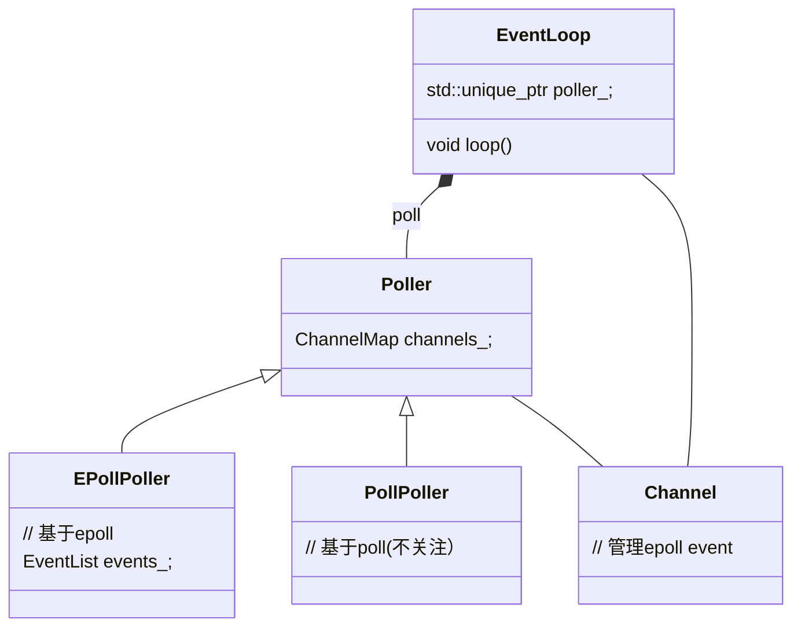

> 📌本文采用wolai制作: 原文 [link](https://www.wolai.com/ravenxrz/fgMUbiv6DPt5w4HU9RdPvE "link")

推荐先看下背后的[io多路复用](https://www.xiaolincoding.com/os/8_network_system/selete_poll_epoll.html#%E6%9C%80%E5%9F%BA%E6%9C%AC%E7%9A%84-socket-%E6%A8%A1%E5%9E%8B "io多路复用")和 [reactor设计模式](https://www.xiaolincoding.com/os/8_network_system/reactor.html#%E6%BC%94%E8%BF%9B "reactor设计模式")。

本文分析muduo中的事件循环 —EventLoop 及其相关类

<!--more-->

# 1 TODO

遗留待看:

- [ ] EventLoop 线程模型&#x20;
- [ ] Acceptor源码
- [ ] Channel tie作用


从一个例子入手, muduo官方的`echo server` main函数如下：

```c++
int main(int argc, char* argv[])
{
  LOG_INFO << "pid = " << getpid() << ", tid = " << CurrentThread::tid();
  LOG_INFO << "sizeof TcpConnection = " << sizeof(TcpConnection);
  if (argc > 1)
  {
    numThreads = atoi(argv[1]);
  }
  bool ipv6 = argc > 2;
   EventLoop loop; 
  InetAddress listenAddr(2000, false, ipv6);
  EchoServer server(&loop, listenAddr);

  server.start();

   loop.loop(); 
}
```

`EventLoop`作为核心，驱动`EchoServer`

# 2 EventLoop&#x20;

## 2.1 类图




## 2.2 loop

先看构造函数

```c++
///
///  Reactor, at most one per thread. 
///  EventLoop 每个线程最多一个
///
/// This is an interface class, so don't expose too much details.
EventLoop::EventLoop()
  : looping_(false),
    quit_(false),
    eventHandling_(false),
    callingPendingFunctors_(false),
    iteration_(0),
     threadId_(CurrentThread::tid()),   // 记录创建线程id, 用于后续debug 
     poller_(Poller::newDefaultPoller(this)), 
    timerQueue_(new TimerQueue(this)),
    wakeupFd_(createEventfd()),
    wakeupChannel_(new Channel(this, wakeupFd_)),
    currentActiveChannel_(NULL)
```

`EventLoop`最重要的接口是`loop`, 看下实现：

```c++
const int  kPollTimeMs  = 10000;

void EventLoop::loop()
{
  assert(!looping_);
  assertInLoopThread();
  looping_ = true;
  quit_ = false;  // FIXME: what if someone calls quit() before loop() ?
  LOG_TRACE << "EventLoop " << this << " start looping";

  while (!quit_)
  {
    activeChannels_.clear();
     pollReturnTime_ = poller_->poll(kPollTimeMs, &activeChannels_); 
    ++iteration_;
    if (Logger::logLevel() <= Logger::TRACE)
    {
      printActiveChannels();
    }
    // TODO sort channel by priority
    eventHandling_ = true;
     for (Channel* channel : activeChannels_)
    {
      currentActiveChannel_ = channel;
      currentActiveChannel_->handleEvent(pollReturnTime_);
    } 
    currentActiveChannel_ = NULL;
    eventHandling_ = false;
     doPendingFunctors(); 
  }

  LOG_TRACE << "EventLoop " << this << " stop looping";
  looping_ = false;
}
```

代码很清晰：

1. 从poller中查询当前可用的`channel`
2. 每个`channel`代表一个可用事件的handler，处理handler
3. 除了poller返回的channel外，事件循环还可以执行其他任务，这些任务都都放到`doPendingFunctors`中, 这些任务通过 `queueInLoop` 函数注册，调用点包括:

   
   > 📌TODO(zhangxingrui): 抽一个函数来分析

poller的分析见[poll](https://www.wolai.com/ravenxrz/fgMUbiv6DPt5w4HU9RdPvE#tGUeJLm9vJ44k6gREWNt19 "poll")

channel的分析见 Channel.

再看下`doPendingFunctors`相关逻辑:


```c++
void EventLoop::doPendingFunctors() {
  std::vector<Functor> functors;
  callingPendingFunctors_ = true;

  {
    MutexLockGuard lock(mutex_);
    functors.swap( pendingFunctors_ );
  }

  for (const Functor &functor : functors) {
    functor();
  }
  callingPendingFunctors_ = false;
}
```

关键是 pendingFunctors\_。

往`pendingFunctors_`中注册的函数为:

```c++
void EventLoop::queueInLoop(Functor cb)
{
  {
  MutexLockGuard lock(mutex_);
   pendingFunctors_ .push_back(std::move(cb));
  }

  if (!isInLoopThread() || callingPendingFunctors_)
  {
     wakeup ();
  }
}


```

看下调用链:


主要在`TcpConnection`和 `TcpClient` ， `TcpServer`以及`Conector`中会用。这些内容不是本文分析重点，予以跳过。

除了 `pendingFunctors_` 可已关注外，还有一个 `wakeup`函数比较好奇。

## 2.3 wakeup

```c++
void EventLoop::wakeup()
{
  uint64_t one = 1;
  ssize_t n =  sockets::write ( wakeupFd_ , &one, sizeof one);
  if (n != sizeof one)
  {
    LOG_ERROR << "EventLoop::wakeup() writes " << n << " bytes instead of 8";
  }
}


```

逻辑很简单，往`wakeFd_`中写入一个one。`wakeFd`来自构造函数:

```c
    wakeupFd_(createEventfd()),


```

```c
int createEventfd()
{
  int evtfd = :: eventfd (0,  EFD_NONBLOCK  | EFD_CLOEXEC);  // 注意是非阻塞的
  if (evtfd < 0)
  {
    LOG_SYSERR << "Failed in eventfd";
    abort();
  }
  return evtfd;
}


```

> 解释下这里的`eventfd`：
>
> `eventfd` 是一种用于事件通知的文件描述符，通常用于进程或线程之间的异步事件通知和同步操作。它是 Linux 系统调用之一，通过创建一个特殊的文件描述符来实现事件通知机制。
>
> 函数原型
>
> ```c
> #include <sys/eventfd.h>
> int eventfd(unsigned int initval, int flags);
> ```
>
> 参数
>
> - **initval**：`eventfd` 的初始值，通常设置为 0。
> - **flags**：用于设置 `eventfd` 的行为，常见的标志包括：
>   - **EFD\_NONBLOCK**：使 `eventfd` 以非阻塞模式操作。
>   - **EFD\_CLOEXEC**：设置文件描述符在执行 `exec` 系统调用时自动关闭（close-on-exec）。
>
> `eventfd` 常用于以下场景：
>
> - **线程间同步**：在多线程程序中，一个线程可以通过写入 `eventfd` 来通知另一个线程。
> - **进程间通信（IPC）**：用于进程之间的事件通知机制。
> - **异步事件处理**：结合 `epoll` 等 I/O 多路复用机制，实现高效的异步 I/O 事件处理。

显然这里的`wakeup`类似生产者消费者模型中，队列来了一个新element，通知线程唤醒来取去消费。

既然有`socket::write`， 那一定有一端在读。分析下源码：

```c++
// 构造函数
wakeupChannel_(new Channel(this, wakeupFd_)),

wakeupChannel_->setReadCallback(std::bind(&EventLoop::handleRead, this));
// we are always reading the wakeupfd
wakeupChannel_->enableReading();

```

原来给这个`wakeupFd`添加了一个channel（channel分析见下文），并开启`Read`监听。只有有人往fd写入，事件就会通知到`handleRead`回调。

```c++
void EventLoop::handleRead()
{
  uint64_t one = 1;
  ssize_t n = sockets::read(wakeupFd_, &one, sizeof one);
  if (n != sizeof one)
  {
    LOG_ERROR << "EventLoop::handleRead() reads " << n << " bytes instead of 8";
  }
}


```

为啥要做这种“无用功”？回到loop循环。

```c++
void EventLoop::loop()
{
   ...
  while (!quit_)
  {
    activeChannels_.clear();
    // poll 是个同步阻塞调用
    pollReturnTime_ = poller_->poll(kPollTimeMs, &activeChannels_); 
    ...
    doPendingFunctors();
  }

  LOG_TRACE << "EventLoop " << this << " stop looping";
  looping_ = false;
}
```

`wakeup`是用来告诉`EventLoop`现在有个pending的functor需要执行，假设`EventLoop`的thread正在polling，如果没有`wakeup`的`waitFd`，只要没有其他fd事件发生，也没有超时，poll就会一直阻塞，导致pending functor得不到执行。所以需要这种机制来唤醒eventloop thread。

> 📌这种机制和采用信号量或者条件变量的性能对比？&#x20;
> 能想到的这种机制可以跨进程玩，但是信号量也可以。 信号量多了一个计数，更适合管理资源。 在同步唤醒（特指生产者消费者这种模式）下，性能谁更好？

# 3 Poller (`EpollPoller`)

在muduo中，有两种类型的poller:


一种基于`epoll`一种基于`poll`  (两种的区别见:  [io多路复用](https://www.xiaolincoding.com/os/8_network_system/selete_poll_epoll.html#%E6%9C%80%E5%9F%BA%E6%9C%AC%E7%9A%84-socket-%E6%A8%A1%E5%9E%8B "io多路复用")) ,具体使用哪种，见`newDefaultPoller`函数:

```c++
Poller* Poller::newDefaultPoller(EventLoop* loop)
{
  if (::getenv("MUDUO_USE_POLL"))
  {
    return new PollPoller(loop);
  }
  else
  {
    return new EPollPoller(loop);
  }
}
```

是通过`MUDUO_USE_POLL`环境变量来设置的，默认都是`epoll`，通常`epoll`性能也会更好， 所以下面只分析`EpollPoller`

先看基类有哪些接口:

```c++
///
/// Base class for IO Multiplexing
///
/// This class doesn't own the Channel objects.
class Poller : noncopyable
{
 public:
  typedef std::vector<Channel*> ChannelList;

  Poller(EventLoop* loop);
  virtual ~Poller();

  /// Polls the I/O events.
  /// Must be called in the loop thread.
  virtual Timestamp poll(int timeoutMs, ChannelList* activeChannels) = 0;

  /// Changes the interested I/O events.
  /// Must be called in the loop thread.
  virtual void updateChannel(Channel* channel) = 0;

  /// Remove the channel, when it destructs.
  /// Must be called in the loop thread.
  virtual void removeChannel(Channel* channel) = 0;

  static Poller* newDefaultPoller(EventLoop* loop);

 protected:
  typedef std::map<int, Channel*> ChannelMap;
   ChannelMap channels_; 

 private:
   EventLoop* ownerLoop_; 
};
```

显然每个`poller`绑定一个`Eventloop`.

回到`EpollPoller`

## 3.1 poll

函数签名如下：

```c++
  Timestamp poll(int timeoutMs, ChannelList* activeChannels) override;

```

- ChannelList在基类中是一个`typedef`, 本质上是个 `std::vector<Channel*>`

函数实现如下:

```c++
Timestamp EPollPoller::poll(int timeoutMs, ChannelList* activeChannels)
{
  LOG_TRACE << "fd total count " << channels_.size();
   int numEvents = ::epoll_wait(epollfd_,
                               &*events_.begin(),
                               static_cast<int>(events_.size()),
                               timeoutMs); 
  int savedErrno = errno;
  Timestamp now(Timestamp::now());
  if (numEvents > 0)
  {
    LOG_TRACE << numEvents << " events happened";
     fillActiveChannels(numEvents, activeChannels);
     if (implicit_cast<size_t>(numEvents) == events_.size())
    {
      events_.resize(events_.size()*2);
    }
  }
  // ...
  return now;
}
```

调用`epoll_wait`, 将监听到的事件存放在 `events_`数组中，或者等到超时（EventLoop中默认超时时间是10s， 见 [这里](https://www.wolai.com/ravenxrz/fgMUbiv6DPt5w4HU9RdPvE#bjWfP9TpHanwEhvfR128vh "这里")。

- `epoll_fd_`来自构造函数
- `events_` 是一个初始大小为16的数组:
  ```c++
  typedef std::vector<struct epoll_event> EventList;
  EventList events_;
  
  ```

```c++
  static const int kInitEventListSize = 16;

EPollPoller::EPollPoller(EventLoop* loop)
  : Poller(loop),
     epollfd_(::epoll_create1(EPOLL_CLOEXEC)), 
     events_(kInitEventListSize)
```

如果返回的events数量等于了当前的size，则扩容2倍。

> 额外补充:  epoll\_create1传入的flag EPOLL\_CLOEXEC的含义: 当进程调用 `execve` 时，epoll fd自动关闭。 避免被子进程集成这个epoll fd。

再看 `fillActiveChannels` 函数:

```c++
void EPollPoller::fillActiveChannels(int numEvents,
                                     ChannelList *activeChannels) const {
  assert(implicit_cast<size_t>(numEvents) <= events_.size());
  for (int i = 0; i < numEvents; ++i) {
    Channel *channel = static_cast<Channel *>( events_ [i].data.ptr);
     channel->set_revents(events_[i].events);
     activeChannels->push_back(channel);
  }
}
```

在`epoll_wait`返回ready的event后，将`events` 转为`channel`, event的结构为:

```c
struct epoll_event {
  uint32_t events;   /* Epoll events */
  epoll_data_t data; /* User data variable */
} __EPOLL_PACKED;


```

`data`字段是user data. 在`fillActiveChannels`中， event的data字段为`channel` pointer， 并通过`set_revents`设置当前真正监听到的event。之后`channel`就可以[消费该事件](https://www.wolai.com/ravenxrz/fgMUbiv6DPt5w4HU9RdPvE#p7srcsQ9sAFczLVeNV5NfZ "消费该事件")。

## 3.2 初始化event user data为channel

那么 `epoll_event`是如何初始化的: 即 event.data.ptr 是如何初始化为 `channel`的?

搜索源码, 发现是`EPollPoller::update`函数中设置:

```c++
void EPollPoller::update(int operation, Channel *channel) {
  struct epoll_event event;
  memZero(&event, sizeof event);
   event.events = channel->events();
  event.data.ptr = channel; 
  int fd = channel->fd();
  LOG_TRACE << "epoll_ctl op = " << operationToString(operation)
            << " fd = " << fd << " event = { " << channel->eventsToString()
            << " }";
  if ( ::epoll_ctl(epollfd_, operation, fd, &event ) < 0) { // 注册/取消监听事件类型
    if (operation == EPOLL_CTL_DEL) {
      LOG_SYSERR << "epoll_ctl op =" << operationToString(operation)
                 << " fd =" << fd;
    } else {
      LOG_SYSFATAL << "epoll_ctl op =" << operationToString(operation)
                   << " fd =" << fd;
    }
  }
}
```

找下调用链:


发现调用是通过`EPollPoller::updateChannel`， 再通过 `Channel::update`调用进来的。`Channel::update`的分析见下文：设置可监听类型。

现在只看 `EPollPoller::updateChannel`

```c++
void EPollPoller::updateChannel(Channel* channel)
{
  Poller::assertInLoopThread();  // 看样子设置Channel update 的caller也必须在event loop中
  const int index =  channel->index();  // index默认值是 kNew 
  LOG_TRACE << "fd = " << channel->fd()
    << " events = " << channel->events() << " index = " << index;
  if (index == kNew || index == kDeleted)
  {
    // a new one, add with EPOLL_CTL_ADD
    int fd = channel->fd();
    if (index == kNew)
    {
      assert(channels_.find(fd) == channels_.end());
       channels_ [fd] = channel;  // channel 是个map
    }
    else // index == kDeleted
    {
      assert(channels_.find(fd) != channels_.end());
      assert(channels_[fd] == channel);
    }

    channel->set_index(kAdded);
    update(EPOLL_CTL_ADD, channel);
  }
  else
  {
    // update existing one with EPOLL_CTL_MOD/DEL
    int fd = channel->fd();
    (void)fd;
    assert(channels_.find(fd) != channels_.end());
    assert(channels_[fd] == channel);
    assert(index == kAdded);
    if (channel->isNoneEvent())
    {
      update(EPOLL_CTL_DEL, channel);
      channel->set_index(kDeleted);
    }
    else
    {
      update(EPOLL_CTL_MOD, channel);
    }
  }
}


```

提供了一层`epoll_cntl`的`op`的封装，用 `channel`的 `index` 表明当前是什么操作，支持的`index`有:

```c++
namespace
{
const int kNew = -1;
const int kAdded = 1;
const int kDeleted = 2;
}
```

此外， Poller class内部还有一个 `channels_` （本质是一个map），保存当前加入过的`channel`

# 4 Channel

官方对`channel`的解释是:

```c++
///
/// A selectable I/O channel.
///
/// This class doesn't own the file descriptor.
/// The file descriptor could be a socket,
/// an eventfd, a timerfd, or a signalfd

```

看下`channel`包含的重要的`public` interface和member:

```c++
  const int Channel::kNoneEvent = 0;
  const int Channel::kReadEvent = POLLIN | POLLPRI;
  const int Channel::kWriteEvent = POLLOUT;

  
  Channel(EventLoop* loop, int fd);
  ~Channel();
  
   // 注册事件产生时的回调 
  void handleEvent(Timestamp receiveTime);
  void setReadCallback(ReadEventCallback cb)
  { readCallback_ = std::move(cb); }
  void setWriteCallback(EventCallback cb)
  { writeCallback_ = std::move(cb); }
  void setCloseCallback(EventCallback cb)
  { closeCallback_ = std::move(cb); }
  void setErrorCallback(EventCallback cb)
  { errorCallback_ = std::move(cb); }
  
   void set_revents(int revt) { revents_ = revt; } // used by pollers

   // 控制可以监听的事件类型 
  void enableReading() { events_ |= kReadEvent;  update();  }  // 这些update就是 `Poller`章节提到的初始化 epoll_event 的地方
  void disableReading() { events_ &= ~kReadEvent;  update();  }
  void enableWriting() { events_ |= kWriteEvent;  update();  }
  void disableWriting() { events_ &= ~kWriteEvent;  update();  }
  void disableAll() { events_ = kNoneEvent;  update();  }
  bool isWriting() const { return events_ & kWriteEvent; }
  bool isReading() const { return events_ & kReadEvent; }

  EventLoop* loop_;
   const int  fd_;
  int        events_;
  int        revents_; // it's the received event types of epoll or poll 

  ReadEventCallback readCallback_;
  EventCallback writeCallback_;
  EventCallback closeCallback_;
  EventCallback errorCallback_;


```

明显`channel`和监听事件相关

- 一个`channel`**只**和一个`fd`绑定, fd从构造函数传入，结合注释来看，`channel`不管理`fd`的生命周期。
- `events` 控制要监听哪些事件，这些监听事件的操作方法通过一系列`enable`和`disable`方法暴露给caller控制。
- `revents_`为实际发生的事件类型，通过 `set_revents`暴露。


前文Poller (`EpollPoller`)已经分析，这里不再赘述。

> 📌TODO(zhangxingrui): 贴poller调用`fillactivechannels`的ref

## 4.1 handleEvent

在[EventLoop](https://www.wolai.com/ravenxrz/fgMUbiv6DPt5w4HU9RdPvE#bjWfP9TpHanwEhvfR128vh "EventLoop") 的`loop`中找到可用`channel`后，就会调用`handleEvent`函数：

```c++
void Channel::handleEvent(Timestamp receiveTime)
{
    ...
    handleEventWithGuard(receiveTime);
    ...
}

```

转到`handleEventWithGuard`:

```c++
void Channel::handleEventWithGuard(Timestamp receiveTime)
{
  eventHandling_ = true;
  LOG_TRACE << reventsToString();
  if ((revents_ & POLLHUP) && !(revents_ & POLLIN))
  {
    if (logHup_)
    {
      LOG_WARN << "fd = " << fd_ << " Channel::handle_event() POLLHUP";
    }
    if (closeCallback_) closeCallback_();
  }

  if (revents_ & POLLNVAL)
  {
    LOG_WARN << "fd = " << fd_ << " Channel::handle_event() POLLNVAL";
  }

  if (revents_ & (POLLERR | POLLNVAL))
  {
    if (errorCallback_) errorCallback_();
  }
  if (revents_ & (POLLIN | POLLPRI | POLLRDHUP))
  {
    if (readCallback_) readCallback_(receiveTime);
  }
  if (revents_ & POLLOUT)
  {
    if (writeCallback_) writeCallback_();
  }
  eventHandling_ = false;
}
```

处理很简单，看当前是什么事件（可能是一组事件），就调用对应回调。

### 4.1.1 epoll event flag解释

额外补充： `handleEventWithGuard`和 enable/disable 系列函数中的 POLLxx这些flag的含义：

1. **EPOLLIN**：
   - 表示对应的文件描述符可以读取数据（包括普通数据和优先数据）。
2. **EPOLLOUT**：
   - 表示对应的文件描述符可以写入数据。
3. **EPOLLRDHUP**：
   - 表示对端关闭了连接的一部分，即读取方向上的挂起事件。这在检测对端关闭连接时非常有用。
4. **EPOLLPRI**：
   - 表示有紧急数据可读，这通常用于带外数据（out-of-band data）。
5. **EPOLLERR**：
   - 表示对应的文件描述符发生错误。当文件描述符发生错误时，这个事件将被触发。
6. **EPOLLHUP**：
   - 表示对应的文件描述符被挂起。通常表示管道或者套接字的一端被关闭。
7. **EPOLLET**：
   - 表示将文件描述符设置为边缘触发（Edge Triggered）模式。在这种模式下，当文件描述符从未就绪到就绪时，`epoll` 仅会报告一次事件。
8. **EPOLLONESHOT**：
   - 表示使用一次性事件，当这个事件被触发并处理后，必须重新设置事件才能再次触发。
9. **EPOLLEXCLUSIVE**：
   - 仅适用于 `epoll_wait` 系统调用。用于避免惊群效应（thundering herd problem），只有一个等待的线程会被唤醒
10. **EPOLLRDBAND**：
    - 表示有优先数据可读。
11. **EPOLLWRBAND**：
    - 表示有优先数据可写。

## 4.2 设置可监听类型

Channel 提供了设置可监听类型的接口：

```c++
 const int Channel::kNoneEvent = 0;
const int Channel::kReadEvent = POLLIN | POLLPRI;
const int Channel::kWriteEvent = POLLOUT;

  
  // 控制可以监听的事件类型
  void enableReading() { events_ |= kReadEvent; update(); }  // 这些update就是 `Poller`章节提到的初始化 epoll_event 的地方
  void disableReading() { events_ &= ~kReadEvent; update(); }
  void enableWriting() { events_ |= kWriteEvent; update(); }
  void disableWriting() { events_ &= ~kWriteEvent; update(); }
  void disableAll() { events_ = kNoneEvent; update(); }

```

还记得在 初始化event user data为channel 一节提到的什么时候初始化 `epoll_event` 吗？ 就是在如上函数。

update实现:


```c++
void Channel::update()
{
  addedToLoop_ = true;
  loop_->updateChannel(this);
}


```

```c++
void EventLoop::updateChannel(Channel* channel)
{
  assert(channel->ownerLoop() == this);
  assertInLoopThread();
  poller_->updateChannel(channel);
}

```

到这里就进入[ ](https://www.wolai.com/ravenxrz/fgMUbiv6DPt5w4HU9RdPvE#nykt6Lc4BDZfdg71SafAYf " ")[Poller](https://www.wolai.com/ravenxrz/fgMUbiv6DPt5w4HU9RdPvE#nykt6Lc4BDZfdg71SafAYf "Poller")[范围了。](https://www.wolai.com/ravenxrz/fgMUbiv6DPt5w4HU9RdPvE#nykt6Lc4BDZfdg71SafAYf "范围了。")

## 4.3 什么时候新建channel

看下`channel`使用到的地方：


前文分析 wakeup 函数时，介绍了 `EventLoop`新建channel的地方。这里再拿 `TcpConnection`看看。

```c++
TcpConnection::TcpConnection(EventLoop* loop,
                             const string& nameArg,
                              int sockfd, 
                             const InetAddress& localAddr,
                             const InetAddress& peerAddr)
  : loop_(CHECK_NOTNULL(loop)),
    name_(nameArg),
    state_(kConnecting),
    reading_(true),
    socket_(new Socket(sockfd)),
     channel_(new Channel(loop, sockfd)), 
    localAddr_(localAddr),
    peerAddr_(peerAddr),
    highWaterMark_(64*1024*1024)
{
  channel_->setReadCallback(
      std::bind(&TcpConnection::handleRead, this, _1));
  channel_->setWriteCallback(
      std::bind(&TcpConnection::handleWrite, this));
  channel_->setCloseCallback(
      std::bind(&TcpConnection::handleClose, this));
  channel_->setErrorCallback(
      std::bind(&TcpConnection::handleError, this));
  LOG_DEBUG << "TcpConnection::ctor[" <<  name_ << "] at " << this
            << " fd=" << sockfd;
  socket_->setKeepAlive(true);
}


```

绑定传入进来的`sockfd`, 对这个fd监听读写、close、error handler。

那么`sockfd`哪来的？


看到`Acceptor`了，`Acceptor`用于新建socket链接，将得到的sockfd传入到connection，connection绑定channel。

# 5 把所有东西串起来

最后用一张图把所有东西串起来:


