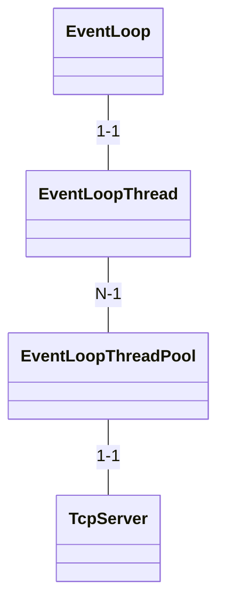

> 📌本文采用wolai制作， [link](https://www.wolai.com/ravenxrz/64a1q1Q3cCT7Dbzm6Bz5Ax "link")


前文[muduo源码分析1-事件循环(上)](https://www.wolai.com/fgMUbiv6DPt5w4HU9RdPvE "muduo源码分析1-事件循环(上)")分析了`EventLoop`及其相关类的基本原理，但是还残留了一个问题，即`EventLoop`的线程模型是怎么样的？

<!--more-->

# 1 类图

和线程相关的类如下:




# 2 EventLoop

`EventLoop中`有个函数一直没分析:

```c++
  void assertInLoopThread()
  {
    if (!isInLoopThread())
    {
      abortNotInLoopThread();
    }
  }


  bool isInLoopThread() const { return  threadId_ == CurrentThread::tid();  }


```

这个函数用于check caller是否在`EventLoop`的thread中，调用包括:


简单看下原理：

`threadId_` 在构造函数中初始化:

```c++
    threadId_(CurrentThread::tid()),

```

`tid`函数：

```c++
namespace CurrentThread
{
  // internal
  extern  __thread  int t_cachedTid;  // 这玩意就是个thread_local

  inline int tid()
  {
    if (__builtin_expect(t_cachedTid == 0, 0))
    {
      cacheTid();
    }
    return t_cachedTid;
 }
  
```

```c
void CurrentThread::cacheTid()
{
  if (t_cachedTid == 0)
  {
    t_cachedTid = detail::gettid();
    t_tidStringLength = snprintf(t_tidString, sizeof t_tidString, "%5d ", t_cachedTid);
  }
}

pid_t gettid()
{
  return static_cast<pid_t>(::syscall(SYS_gettid));
}


```

做了一次gettid的cache。 避免多次系统调用。

在构造函数中保留构造`EventLoop`的`tid`，后续的`caller`如果不在这个`tid`上，就abort(通过`abortNotInLoopThread`函数)。

# 3 EventLoopThread

定义:

```c++
class EventLoopThread : noncopyable
{
 public:
  typedef std::function<void(EventLoop*)> ThreadInitCallback;

  EventLoopThread(const ThreadInitCallback& cb = ThreadInitCallback(),
                  const string& name = string());
  ~EventLoopThread();
   EventLoop* startLoop();
 
 private:
   void threadFunc();
 
   EventLoop* loop_ GUARDED_BY(mutex_);
   bool exiting_;
  Thread thread_;
  MutexLock mutex_;
  Condition cond_ GUARDED_BY(mutex_);
  ThreadInitCallback callback_;
};


```

一个线程绑定一个`Eventloop`。

构造函数:

```c++
EventLoopThread::EventLoopThread(const ThreadInitCallback& cb,
                                 const string& name)
  : loop_(NULL),
    exiting_(false),
     thread_(std::bind(&EventLoopThread::threadFunc, this), name),
     mutex_(),
    cond_(mutex_),
    callback_(cb)
{
}


```

线程主函数是 `threadFunc`

```c++
void EventLoopThread::threadFunc()
{
  EventLoop loop;

  if (callback_)  // 初始化的cb
  {
    callback_(&loop);
  }

  {
    MutexLockGuard lock(mutex_);
    loop_ = &loop;
    cond_.notify();  // 有个cv， 谁在等待？
  }

  loop.loop(); // 死循环
  //assert(exiting_);
  MutexLockGuard lock(mutex_);
  loop_ = NULL;
}

```

线程是`loop`死循环。 另外初始化完成时还会有个`notify`。

剩下两个问题:

1. 谁在等待`notify`?
2. 线程是什么时候启动的?

两个问题的解答都在`startLoop` 函数：

```c++
EventLoop* EventLoopThread::startLoop()
{
  assert(!thread_.started());
  thread_.start(); // 启动

  EventLoop* loop = NULL;
  {
    MutexLockGuard lock(mutex_);
    while (loop_ == NULL)
    {
       cond_.wait();  // 等待loop初始化完成 
    }
    loop = loop_;
  }

  return loop;
}


```

查看调用链， 调用`startLoop`的地方在`EventLoopThreadPool`


# 4 EventLoopThreadPool

核心成员变量:

```c++
  EventLoop* baseLoop_;
   string name_;
  bool started_;
  int numThreads_;
  int next_;
   std::vector<std::unique_ptr<EventLoopThread>> threads_;
  std::vector<EventLoop*> loops_;
```

线程池自然是要管理一组线程的。

看下`start`函数:

```c++
void EventLoopThreadPool::start(const ThreadInitCallback& cb)
{
  assert(!started_);
  baseLoop_->assertInLoopThread();

  started_ = true;

  for (int i = 0; i <  numThreads_ ; ++i)
  {
    char buf[name_.size() + 32];
    snprintf(buf, sizeof buf, "%s%d", name_.c_str(), i);
    EventLoopThread* t = new EventLoopThread(cb, buf);
     threads_.push_back(std::unique_ptr<EventLoopThread>(t));
    loops_.push_back(t->startLoop()); 
  }
  if (numThreads_ == 0 && cb)
  {
    cb(baseLoop_);
  }
}


```

`numThreads_`由`caller`传入:

```c++
  void setThreadNum(int numThreads) { numThreads_ = numThreads; }

```

这里的`baseLoop_` 是干嘛的?搜下源码:


看起来只是保证各个调用都在baseLoop 的context下，另外就是如果不设置`numThreads`，那默认就是一个`eventloop`。

另一个比较重要的函数是`getNextLoop`:

```c++
EventLoop* EventLoopThreadPool::getNextLoop()
{
  baseLoop_->assertInLoopThread();
  assert(started_);
  EventLoop* loop = baseLoop_;

  if (!loops_.empty())
  {
    // round-robin
    loop = loops_[next_];
    ++next_;
    if (implicit_cast<size_t>(next_) >= loops_.size())
    {
      next_ = 0;
    }
  }
  return loop;
}


```

`caller`每次调用可以从`pool`中获取一个`loop`.

剩下的问题就是谁在用`EventLoopThreadPool`, 又是怎么用的？

查了下源码，只有`TcpServer`在用。

# 5 TcpServer

初始化：

```c++
TcpServer::TcpServer(EventLoop* loop,
                     const InetAddress& listenAddr,
                     const string& nameArg,
                     Option option)
  : loop_(CHECK_NOTNULL(loop)),
    ipPort_(listenAddr.toIpPort()),
    name_(nameArg),
    acceptor_(new Acceptor(loop, listenAddr, option == kReusePort)),
     threadPool_(new EventLoopThreadPool(loop, name_)),
     connectionCallback_(defaultConnectionCallback),
    messageCallback_(defaultMessageCallback),
    nextConnId_(1)
{
   acceptor_->setNewConnectionCallback(
      std::bind(&TcpServer::newConnection, this, _1, _2)); 
}
```

设置线程数:

```c++
void TcpServer::setThreadNum(int numThreads)
{
  assert(0 <= numThreads);
  threadPool_->setThreadNum(numThreads);
}

```

启动：

```c++
void TcpServer::start()
{
  if (started_.getAndSet(1) == 0)
  {
     threadPool_->start(threadInitCallback_);
 
    assert(!acceptor_->listening());
    loop_->runInLoop(
        std::bind(&Acceptor::listen, get_pointer(acceptor_)));
  }
}


```

使用：

```c++
void TcpServer::newConnection(int sockfd, const InetAddress& peerAddr)
{
  loop_->assertInLoopThread();
   EventLoop* ioLoop = threadPool_->getNextLoop();
   char buf[64];
  snprintf(buf, sizeof buf, "-%s#%d", ipPort_.c_str(), nextConnId_);
  ++nextConnId_;
  string connName = name_ + buf;

  LOG_INFO << "TcpServer::newConnection [" << name_
           << "] - new connection [" << connName
           << "] from " << peerAddr.toIpPort();
  InetAddress localAddr(sockets::getLocalAddr(sockfd));
  // FIXME poll with zero timeout to double confirm the new connection
  // FIXME use make_shared if necessary
   TcpConnectionPtr conn(new TcpConnection(ioLoop,
                                          connName,
                                          sockfd,
                                          localAddr,
                                          peerAddr)); 
  connections_[connName] = conn;
  conn->setConnectionCallback(connectionCallback_);
  conn->setMessageCallback(messageCallback_);
  conn->setWriteCompleteCallback(writeCompleteCallback_);
  conn->setCloseCallback(
      std::bind(&TcpServer::removeConnection, this, _1)); // FIXME: unsafe
  ioLoop->runInLoop(std::bind(&TcpConnection::connectEstablished, conn));
}


```

看起来每次新建连接进入到此函数，在此函数中从`ThreadPool`中获取一个`loop`， 建立`TcpConnection`对象，在该对象中，建立处理sockfd的channel。

```c++

TcpConnection::TcpConnection(EventLoop* loop,
                             const string& nameArg,
                             int sockfd,
                             const InetAddress& localAddr,
                             const InetAddress& peerAddr)
  : loop_(CHECK_NOTNULL(loop)),
    name_(nameArg),
    state_(kConnecting),
    reading_(true),
    socket_(new Socket(sockfd)),
     channel_(new Channel(loop, sockfd)), 
    localAddr_(localAddr),
    peerAddr_(peerAddr),
    highWaterMark_(64*1024*1024)
{
  channel_->setReadCallback(
      std::bind(&TcpConnection::handleRead, this, _1));
  channel_->setWriteCallback(
      std::bind(&TcpConnection::handleWrite, this));
  channel_->setCloseCallback(
      std::bind(&TcpConnection::handleClose, this));
  channel_->setErrorCallback(
      std::bind(&TcpConnection::handleError, this));
  LOG_DEBUG << "TcpConnection::ctor[" <<  name_ << "] at " << this
            << " fd=" << sockfd;
  socket_->setKeepAlive(true);
}
```

由此，所有东西都可以串起来了。

# 6 一图串起来

_ImUxIpYNcn.png>)

来和 [reactor 设计模式](https://www.xiaolincoding.com/os/8_network_system/reactor.html#%E6%BC%94%E8%BF%9B "reactor 设计模式")对比， 很明显muduo 符合 多Reactor 多线程模型。


